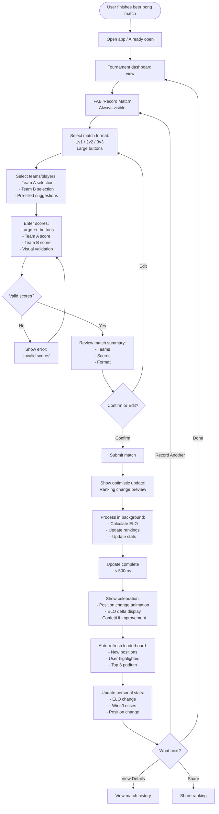
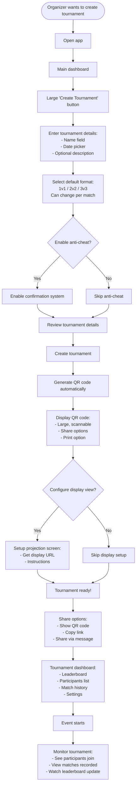

# UX Design Specification beer-pong-league

**Author:** floppyflax
**Date:** 2026-01-23

---

## Executive Summary

### Project Vision

Beer Pong League transforms tournament management from a functional tool into an engaging social experience. The platform combines intelligent tournament management with gamification, real-time engagement, and community building to create memorable moments that keep players and bars coming back.

**Core Innovation:**
- **ELO Professional System for Amateur Events**: Applying a professional ELO ranking system (used in esports and competitive sports) to very casual, amateur events (beer pong between friends), creating continuity and visible progression between isolated tournaments.
- **Display Screen as Central Experience**: A real-time projection screen becomes the "beating heart" that creates collective excitement and memorable moments, making tournaments engaging for the entire crowd, not just individual players.

**Vision Statement:**
Transform from a functional tournament management tool into the most engaging social platform for bar entertainment competitions, where players compete for fun, bars create memorable experiences, and communities form around shared passion for beer pong.

### Target Users

#### Primary Users

**1. Event Organizers (Thomas - Main Persona)**
- **Profile:** 32 years old, organizes social events (barbecues, birthdays, parties) with beer pong tournaments
- **Context:** Regularly organizes events with beer pong tournaments
- **Motivation:** Create memorable moments, simplify organization, enjoy their event rather than managing scores
- **Pain Points:** Manual score tracking with whiteboard and markers, unclear scores, always needs to be involved, spends more time managing scores than enjoying the event, no continuity between events
- **Success Vision:** Create a championship in a few clicks, generate QR code automatically, configure projection screen, participants record matches themselves, ranking updates automatically with animations

**2. Regular Players (Lucas - Casual Player Who Becomes Addicted)**
- **Profile:** 28 years old, friend participating in events, loves competition and stats
- **Context:** Participates in beer pong tournaments at social events
- **Motivation:** Prove they're better, fun competition between friends, track their progression
- **Pain Points:** Can't see progression between events, no continuity, no personal stats (ELO, wins, losses), no way to compare with friends, no recognition for performances
- **Success Vision:** Join championship via QR code with zero-friction, record matches easily, see ranking evolve in real-time, discover detailed personal stats, share ranking on social media, create own event

**3. Bar Owners/Managers (Sophie)**
- **Profile:** 35 years old, bar owner/manager or bar chain
- **Context:** Seeks to create unique experiences to differentiate their establishment
- **Motivation:** Increase attendance, create customer loyalty, generate recurring revenue
- **Pain Points:** Difficulty creating engaging and memorable experiences, lack of tools for organizing regular tournaments, no way to track customer engagement, difficulty differentiating from competitors
- **Success Vision:** Organize regular tournaments easily, create excitement with projection screen and animations, personalized branding (white-label), track engagement and participant statistics, multi-venue support for chains

### Key Design Challenges

**1. "Alcohol-Friendly" Interface**
- **Challenge:** Interface must be usable even in evening settings with potential cognitive constraints (alcohol, noise, distractions)
- **Requirements:** Large buttons (minimum 44x44px), minimal flow (2-3 clicks max for main actions), optimized readability (strong contrasts, large font sizes), intuitive navigation
- **Impact:** Critical for user adoption and satisfaction in bar environments

**2. Zero-Friction Onboarding**
- **Challenge:** Users must be able to join a championship via QR code in < 30 seconds without creating an account
- **Requirements:** QR code scanning works on mobile, quick name entry (no account required), guest mode functional, seamless transition from anonymous to authenticated user
- **Impact:** Reduces barriers to entry and maximizes participation in events

**3. Dual Identity Management**
- **Challenge:** Seamless handling of both authenticated users and anonymous players with optional merge
- **Requirements:** Clear distinction between modes, smooth promotion from guest to account, automatic data merge, no data loss during transition
- **Impact:** Enables casual participation while supporting long-term engagement

**4. Immediate Feedback & Real-Time Updates**
- **Challenge:** Ranking must update in < 500ms after match recording to create "wow moments"
- **Requirements:** Optimistic updates, efficient state management, real-time synchronization, visual feedback (animations, confetti)
- **Impact:** Creates engaging experience and validates the value proposition

**5. Collective Experience (Post-MVP)**
- **Challenge:** Display screen must engage entire crowd, not just individual players
- **Requirements:** Real-time updates (< 200ms latency), animations and visual effects, optimized readability from distance, creates collective excitement
- **Impact:** Differentiates the platform and creates memorable moments

### Design Opportunities

**1. Visual Gamification**
- **Opportunity:** Create "wow moments" through animations, confetti, and celebrations when players progress
- **Implementation:** Visual feedback on ELO changes, position changes in ranking, achievement celebrations, streak indicators
- **Value:** Transforms functional tracking into exciting engagement, increases motivation and social sharing

**2. Social-First Approach**
- **Opportunity:** Superior community features compared to enterprise-focused competitors
- **Implementation:** Social leaderboards, friend connections, rivalry tracking, social sharing (Instagram, Facebook), comparison with friends
- **Value:** Builds community, increases retention, creates viral growth through social sharing

**3. Mobile-First Experience**
- **Opportunity:** 73% of sports fans use mobile apps, but competitors are desktop-first
- **Implementation:** Native mobile apps (post-MVP), optimized mobile web experience, location-based features, seamless mobile payment integration
- **Value:** Matches user behavior patterns, creates competitive advantage, enables bar environment usage

**4. Visible Progression**
- **Opportunity:** Make ELO evolution tangible and motivating through visual design
- **Implementation:** Clear visual representation of ELO changes, position changes highlighted, progression charts, personal stats dashboard
- **Value:** Creates motivation for continued participation, validates the ELO system value, increases engagement

**5. Bar Environment Optimization**
- **Opportunity:** Deep understanding of bar culture and tournament dynamics
- **Implementation:** Display view optimized for projection, venue branding (white-label), multi-venue support, future POS integration
- **Value:** Differentiates from generic solutions, creates value for bar owners, enables B2B revenue stream

## Core User Experience

### Defining Experience

**Core User Action:**
The primary user action that defines Beer Pong League is **adding match scores and consulting the leaderboard**. This is the most frequent interaction and the critical loop that creates value:

1. **Record Match Result** - Users record the outcome of a beer pong match (scores, participants)
2. **View Updated Ranking** - Users immediately see how their position changed in the leaderboard

This core loop transforms functional score tracking into engaging competition through visible progression and immediate feedback.

**Critical Interaction:**
Match score validation must be **perfect** - this is the make-or-break moment. The score entry process must be:
- **Effortless** - Minimum clicks possible
- **Simple** - No cognitive load, even in bar environment
- **Fast** - Complete in < 1 minute
- **Reliable** - Zero ambiguity, clear confirmation

**Core Experience Loop:**
1. User finishes a beer pong match
2. Opens app → Selects tournament → Records match (scores, teams)
3. Submits → Sees immediate ranking update with animations
4. Views leaderboard → Sees position change, ELO evolution
5. (Optional) Shares achievement or checks stats

This loop creates the "wow moment" when ranking updates with visual feedback, making functional tracking exciting and engaging.

### Platform Strategy

**Multi-Platform Approach:**

**1. Web Application (MVP)**
- **Primary Platform:** Responsive web app optimized for mobile
- **Use Cases:** 
  - Tournament management (organizers)
  - Match recording (players on mobile)
  - Leaderboard viewing (all users)
- **Technical:** React SPA, offline-first with localStorage fallback
- **Deployment:** Vercel (static SPA)

**2. Display/Projection View (Post-MVP)**
- **Platform:** Web application (dedicated view mode)
- **Use Cases:**
  - Real-time leaderboard projection in bars
  - Live tournament updates on screen/TV
  - Collective engagement for entire crowd
- **Technical:** Optimized for large screens, real-time updates (< 200ms latency)
- **Access:** Dedicated URL for projection screen

**3. Mobile Application (Post-MVP - V1.5)**
- **Platform:** Native iOS + Android apps
- **Use Cases:**
  - Primary interface for players in bar environment
  - QR code scanning for tournament joining
  - Push notifications for engagement
  - Location-based features (future)
- **Technical:** React Native (cross-platform), shares code with web
- **Synchronization:** Same Supabase backend, real-time sync

**Platform Priorities:**
- **MVP:** Web responsive (mobile-optimized)
- **V1.5:** Native mobile apps + display view
- **Future:** Enhanced mobile features (geolocation, advanced notifications)

**Offline Functionality:**
- **Web:** Full offline support via localStorage, automatic sync on reconnect
- **Mobile:** Online-first (bar environment has internet), local cache for frequently accessed data

**Device Capabilities:**
- **Camera:** QR code scanning (mobile apps)
- **Push Notifications:** Engagement and retention (mobile apps)
- **Geolocation:** Event discovery (future, V2+)
- **Vibration/Haptic Feedback:** Match recording confirmation (optional, mobile)

### Effortless Interactions

**Zero-Thought Interactions:**

**1. Match Score Validation**
- **Requirement:** Completely effortless, minimum clicks, maximum simplicity
- **Implementation:**
  - Large, clear buttons for score entry
  - Pre-filled participant selection (based on tournament)
  - One-tap score increments/decrements
  - Visual confirmation before submission
  - Auto-save draft if user navigates away
- **Target:** Complete match recording in < 30 seconds, < 3 clicks

**2. Leaderboard Consultation**
- **Requirement:** Instant access, zero friction
- **Implementation:**
  - Always accessible from main navigation
  - Auto-refresh on match submission
  - Clear visual hierarchy (Top 3 highlighted)
  - Position changes highlighted with animations
  - Scrollable list with search/filter (for large tournaments)
- **Target:** View ranking in < 1 second, understand position immediately

**3. Automatic Ranking Updates**
- **Requirement:** Happens automatically without user intervention
- **Implementation:**
  - ELO calculation happens server-side automatically
  - Ranking updates in real-time (< 500ms)
  - Visual feedback: animations, confetti, position change indicators
  - Push notifications (mobile) for significant changes
  - Display screen updates automatically (post-MVP)
- **Target:** User sees ranking change immediately after match submission

**4. Tournament Joining (QR Code)**
- **Requirement:** Join tournament in < 30 seconds, zero account required
- **Implementation:**
  - Scan QR code → Opens tournament page
  - Enter name only (no account needed)
  - Auto-join tournament
  - Immediate access to match recording
- **Target:** From QR scan to ready to play in < 30 seconds

**Eliminated Friction Points:**
- No account required for initial participation
- No manual bracket management
- No score calculation (automatic ELO)
- No manual ranking updates
- No complex tournament setup

### Critical Success Moments

**1. First Match Recorded Successfully**
- **Moment:** User records their first match without help or confusion
- **Success Criteria:** 90% of users complete first match recording without assistance
- **Design Focus:** Clear visual guidance, large touch targets, minimal steps
- **Impact:** Validates "alcohol-friendly" interface design

**2. Ranking Update "Wow Moment"**
- **Moment:** User sees their ranking update with animations after match submission
- **Success Criteria:** 80% of users view leaderboard after recording a match
- **Design Focus:** Immediate visual feedback, clear position changes, celebration animations
- **Impact:** Transforms functional tracking into exciting engagement

**3. Tournament Join via QR Code**
- **Moment:** User scans QR code and joins tournament seamlessly
- **Success Criteria:** 70% of QR scans result in tournament join
- **Design Focus:** Zero-friction onboarding, clear next steps, immediate value
- **Impact:** Reduces barriers to entry, maximizes participation

**4. Display Screen Engagement (Post-MVP)**
- **Moment:** Entire crowd reacts to ranking update on projection screen
- **Success Criteria:** 60% of events use display screen, 70% of participants watch it
- **Design Focus:** Large, readable design, engaging animations, collective excitement
- **Impact:** Creates memorable moments, differentiates platform

**5. Guest to Account Conversion**
- **Moment:** Guest player creates account to preserve their stats
- **Success Criteria:** 20% of guest players convert to accounts
- **Design Focus:** Clear value proposition, seamless merge, no data loss
- **Impact:** Builds long-term engagement and retention

**Make-or-Break Flows:**
- Match score entry (if this fails, entire value proposition fails)
- Ranking visibility (if users can't see progression, engagement drops)
- Tournament joining (if friction too high, participation decreases)
- Real-time updates (if laggy, loses "wow moment" impact)

### Experience Principles

**1. Effortless First, Powerful Second**
- Every interaction must feel natural and require zero thought
- Complexity is hidden behind simple interfaces
- Power users can access advanced features, but core actions are always simple
- **Example:** ELO calculation is complex, but user only sees "win = go up, lose = go down"

**2. Immediate Visual Feedback**
- Every action has immediate visual response
- Ranking updates happen in < 500ms with animations
- Progress is always visible and tangible
- Celebrations create emotional connection
- **Example:** Match submission triggers confetti and position change animation

**3. Zero-Friction Participation**
- Join tournament in < 30 seconds, no account required
- Record match in < 1 minute, minimum clicks
- View ranking instantly, always accessible
- No barriers between user and core value
- **Example:** QR code scan → name entry → ready to play

**4. Context-Aware Design**
- Interface adapts to bar environment (large buttons, high contrast)
- Works offline when internet is spotty
- Mobile-first for primary use case
- Display view optimized for projection
- **Example:** "Alcohol-friendly" design with 44px+ touch targets

**5. Social-First Engagement**
- Leaderboard is always visible and engaging
- Progression is shareable and comparable
- Collective experience via display screen
- Community features enhance competition
- **Example:** Ranking updates create excitement for entire crowd, not just individual

**6. Automatic Intelligence**
- ELO calculation happens automatically
- Ranking updates without user action
- Smart defaults reduce decision fatigue
- System handles complexity, user enjoys simplicity
- **Example:** Match submission automatically updates all relevant rankings and stats

## Desired Emotional Response

### Primary Emotional Goals

**Core Emotional Experience:**
Beer Pong League should make users feel **fun, amusement, and excitement**. The platform transforms functional tournament management into an engaging, entertaining experience that creates positive emotional connections.

**Primary Emotional States:**

1. **Fun & Amusement**
   - Users should enjoy using the platform, not just tolerate it
   - The experience should feel playful and entertaining
   - Even functional tasks (recording scores) should feel engaging
   - **Design Implication:** Gamification, animations, playful interactions, celebration moments

2. **Excitement**
   - Users should feel excited about their progression and competition
   - Anticipation builds when recording a match (wondering how ranking will change)
   - Excitement about future matches and opportunities to improve
   - **Design Implication:** Real-time updates, visual feedback, progress indicators, anticipation-building moments

3. **Pride & Accomplishment**
   - Users feel proud when well-ranked, driving social sharing
   - Sense of accomplishment when seeing ranking improve
   - Recognition for performance creates positive reinforcement
   - **Design Implication:** Highlight achievements, celebrate progress, make rankings visible and shareable

4. **Motivation to Continue**
   - Even when ranking drops, users feel motivated to play again and improve
   - The system creates a positive feedback loop: play → see results → want to play more
   - Progress is always possible, creating hope and engagement
   - **Design Implication:** Show clear path to improvement, highlight what's achievable, maintain positive framing

**Emotional Differentiation:**
Unlike enterprise tournament management tools that feel functional and serious, Beer Pong League should feel **light, fun, and social**. The emotional experience differentiates the platform by making competition enjoyable rather than stressful, and making progression exciting rather than just informative.

### Emotional Journey Mapping

**1. Discovery Phase (QR Code Scan / First Encounter)**
- **Emotional State:** Surprised, intrigued, interested
- **User Feeling:** "This looks interesting, I want to try it"
- **Design Approach:**
  - Clear, inviting interface
  - Immediate value visible (see tournament, see other players)
  - Low commitment (no account required)
  - Quick onboarding that builds curiosity
- **Key Moment:** User scans QR code and immediately understands what they can do

**2. Core Action Phase (Recording a Match)**
- **Emotional State:** Excited, anticipatory
- **User Feeling:** "I'm excited to see how my ranking will change"
- **Design Approach:**
  - Simple, fast match recording process
  - Visual feedback during entry
  - Anticipation-building moments (loading states, progress indicators)
  - Clear confirmation before submission
- **Key Moment:** User submits match and waits for ranking update

**3. Result Phase (Viewing Updated Ranking)**
- **Emotional State:** Content (if ranking up) OR Disappointed but motivated (if ranking down)
- **User Feeling:** 
  - "Yes! I moved up!" (celebration, pride)
  - "I dropped, but I can play again to improve" (determination, motivation)
- **Design Approach:**
  - Immediate visual feedback (< 500ms)
  - Celebrations for positive changes (confetti, animations)
  - Positive framing for negative changes (show path to improvement)
  - Always show opportunity to play again
- **Key Moment:** User sees ranking update with visual feedback

**4. Engagement Phase (Between Matches)**
- **Emotional State:** Excited, engaged, belonging
- **User Feeling:** "I'm excited to play more matches to progress in the ranking"
- **Design Approach:**
  - Easy access to record next match
  - Show progression opportunities
  - Display screen creates collective excitement (post-MVP)
  - Social features show community engagement
- **Key Moment:** User feels part of the tournament community

**5. Error/Problem Phase (If Something Goes Wrong)**
- **Emotional State:** Supported, confident (not frustrated)
- **User Feeling:** "I know what to do, the system will help me"
- **Design Approach:**
  - Clear error messages
  - Helpful guidance
  - Easy recovery paths
  - Maintain positive tone even in error states
- **Key Moment:** User understands the issue and knows how to resolve it

**6. Return/Repeat Phase (Coming Back to Use Again)**
- **Emotional State:** Familiar, confident, excited
- **User Feeling:** "I know how this works, I'm excited to see my progress"
- **Design Approach:**
  - Consistent, familiar interface
  - Quick access to key actions
  - Show progress since last visit
  - Maintain excitement through new opportunities
- **Key Moment:** User returns and immediately feels comfortable and engaged

### Micro-Emotions

**Critical Micro-Emotions to Achieve:**

**1. Confidence (vs. Confusion)**
- **Goal:** Users feel confident they understand how to use the platform
- **Achievement:** 90% complete first match recording without help
- **Design Approach:**
  - Clear visual hierarchy
  - Intuitive interactions
  - Large, obvious buttons
  - Minimal cognitive load
  - Progressive disclosure (show what's needed, hide complexity)

**2. Excitement (vs. Anxiety)**
- **Goal:** Users feel excited about competition, not anxious about complexity
- **Achievement:** 80% view leaderboard after recording match (shows engagement)
- **Design Approach:**
  - Positive framing of competition
  - Fun, playful interactions
  - Celebrations for achievements
  - Clear progress indicators
  - Reduce uncertainty (show what happens next)

**3. Accomplishment (vs. Frustration)**
- **Goal:** Users feel accomplished when progressing, not frustrated when declining
- **Achievement:** Users motivated to play again even after ranking drop
- **Design Approach:**
  - Celebrate all progress (even small)
  - Frame setbacks as opportunities
  - Show clear path to improvement
  - Highlight achievements prominently
  - Maintain positive tone throughout

**4. Satisfaction (vs. Disappointment)**
- **Goal:** Users feel satisfied with the experience, even when outcomes aren't ideal
- **Achievement:** High return rate (10% retention at 30 days)
- **Design Approach:**
  - Smooth, polished interactions
  - Immediate feedback
  - Reliable performance
  - Beautiful, engaging visuals
  - Consistent experience quality

**5. Belonging (vs. Isolation)**
- **Goal:** Users feel part of a community, not isolated
- **Achievement:** 20% conversion from guest to account (shows engagement)
- **Design Approach:**
  - Social leaderboards
  - Collective experience (display screen)
  - Friend connections (post-MVP)
  - Community features
  - Shared celebrations

**Emotions to Avoid:**
- **Confusion:** Complex interfaces, unclear actions
- **Anxiety:** Uncertainty about what happens next, fear of making mistakes
- **Frustration:** Slow performance, unclear errors, difficult interactions
- **Disappointment:** Poor experience quality, unreliable functionality
- **Isolation:** Feeling alone, no social connection

### Design Implications

**Emotion-Design Connections:**

**1. Fun & Amusement → Playful Design Elements**
- **UX Choices:**
  - Gamification: Animations, confetti, celebrations
  - Playful micro-interactions (button presses, transitions)
  - Colorful, energetic visual design
  - Fun copy and messaging
  - Engaging visual feedback
- **Specific Examples:**
  - Confetti animation when ranking improves
  - Playful loading states
  - Celebratory messages for achievements
  - Fun illustrations or icons

**2. Excitement → Anticipation-Building Interactions**
- **UX Choices:**
  - Real-time updates with visual feedback
  - Progress indicators during match submission
  - Animated transitions showing ranking changes
  - Clear "what happens next" communication
  - Build suspense before revealing results
- **Specific Examples:**
  - Animated ranking update after match submission
  - Progress bar during ELO calculation
  - Smooth transitions between states
  - Highlighted position changes

**3. Pride & Accomplishment → Achievement Celebration**
- **UX Choices:**
  - Prominent display of achievements
  - Shareable ranking screens
  - Top 3 special highlighting
  - Achievement badges and milestones (post-MVP)
  - Progress visualization
- **Specific Examples:**
  - Top 3 podium design on leaderboard
  - Share button for ranking screenshots
  - Achievement notifications
  - Progress charts showing improvement

**4. Motivation → Positive Framing & Opportunity**
- **UX Choices:**
  - Always show path to improvement
  - Frame setbacks positively
  - Highlight next opportunities
  - Easy access to play again
  - Show achievable goals
- **Specific Examples:**
  - "Play again to improve" messaging after ranking drop
  - Show how many matches needed to reach next position
  - Highlight upcoming tournament opportunities
  - Clear call-to-action for next match

**5. Confidence → Clarity & Simplicity**
- **UX Choices:**
  - Large, clear buttons (44px+)
  - Minimal steps for core actions
  - Clear visual feedback
  - Intuitive navigation
  - Helpful guidance when needed
- **Specific Examples:**
  - One-tap score increments
  - Clear confirmation before submission
  - Obvious navigation patterns
  - Helpful tooltips for first-time users

**6. Belonging → Social & Collective Features**
- **UX Choices:**
  - Visible leaderboards
  - Display screen for collective experience
  - Social sharing capabilities
  - Friend connections (post-MVP)
  - Community engagement features
- **Specific Examples:**
  - Large, visible leaderboard
  - Display screen showing all participants
  - Social share buttons
  - Friend comparison features (post-MVP)

**Negative Emotion Prevention:**
- **Prevent Confusion:** Clear labels, obvious actions, helpful guidance
- **Prevent Anxiety:** Show what happens next, reduce uncertainty, provide reassurance
- **Prevent Frustration:** Fast performance, clear errors, easy recovery
- **Prevent Disappointment:** Reliable functionality, polished interactions, consistent quality
- **Prevent Isolation:** Social features, community engagement, collective experiences

### Emotional Design Principles

**1. Fun First, Function Second**
- Every interaction should feel enjoyable, not just functional
- Gamification and playfulness enhance rather than distract
- Even serious actions (score entry) should feel engaging
- **Example:** Match submission feels like a celebration, not just data entry

**2. Celebrate Progress, Frame Setbacks Positively**
- Always highlight achievements and progress
- Frame ranking drops as opportunities, not failures
- Show clear path to improvement
- Maintain positive tone throughout experience
- **Example:** "You dropped 2 positions, but you're only 1 win away from climbing back!"

**3. Build Anticipation, Deliver Excitement**
- Create moments of anticipation (waiting for ranking update)
- Deliver exciting reveals (animated ranking changes)
- Build suspense before showing results
- Make waiting enjoyable, not frustrating
- **Example:** Animated progress indicator during match processing, then exciting reveal

**4. Immediate Emotional Feedback**
- Every action should have immediate emotional response
- Visual feedback creates instant connection
- Celebrations happen in real-time
- Progress is always visible and tangible
- **Example:** Confetti and animation immediately after match submission

**5. Social Connection & Belonging**
- Make users feel part of a community
- Collective experiences create shared excitement
- Social features enhance individual experience
- Leaderboards create sense of competition and belonging
- **Example:** Display screen creates collective "wow moment" for entire crowd

**6. Confidence Through Clarity**
- Users should always know what to do
- Interface should feel familiar and intuitive
- Errors should be clear and recoverable
- Guidance should be helpful, not condescending
- **Example:** Large, obvious buttons make users confident they can use the app even in bar environment

**7. Maintain Excitement Across Journey**
- Excitement shouldn't fade after first use
- New opportunities create continued engagement
- Progress visualization maintains motivation
- Social features create ongoing interest
- **Example:** Users excited to return because they see new matches available, friends playing, or opportunities to improve ranking

## UX Pattern Analysis & Inspiration

### Inspiring Products Analysis

**1. Mon Petit Gazon (Sports Prediction App)**
- **Core Problem Solved:** Makes sports predictions fun and social through competition with friends
- **UX Strengths:**
  - **Simple onboarding:** Quick setup, join leagues via invitation
  - **Clear leaderboard:** Always visible, easy to understand ranking
  - **Social engagement:** Compare with friends, see their predictions
  - **Gamification:** Points, rankings, achievements create engagement
  - **Visual feedback:** Clear indication of wins/losses, position changes
- **What Makes It Compelling:**
  - Low barrier to entry (quick setup)
  - Social competition creates motivation
  - Clear progression visible through rankings
  - Fun, light-hearted approach to competition
- **What Keeps Users Coming Back:**
  - Regular events (weekly matches)
  - Social comparison with friends
  - Visible progression and achievements
  - Easy to participate (low time commitment)

**2. Dart/Fléchettes Apps (Bar Game Apps)**
- **Core Problem Solved:** Quick score tracking in bar environment
- **UX Strengths:**
  - **Large touch targets:** Designed for bar environment (fingers, potential distractions)
  - **Quick score entry:** Minimal taps, fast input
  - **Simple navigation:** Clear, obvious actions
  - **Visual clarity:** High contrast, readable in dim lighting
  - **Offline capability:** Works without perfect connection
- **What Makes It Compelling:**
  - Effortless score tracking
  - Works in challenging environment (bar, noise, distractions)
  - Immediate feedback
  - No learning curve
- **What Keeps Users Coming Back:**
  - Fast, reliable performance
  - Easy to use even after drinks
  - Consistent, familiar interface

**3. ELO-Based Gaming Apps (Chess.com, Lichess, etc.)**
- **Core Problem Solved:** Make competitive ranking visible and motivating
- **UX Strengths:**
  - **Progression visualization:** Clear ELO display, history charts
  - **Immediate feedback:** Rating changes visible after each game
  - **Achievement system:** Milestones, badges, celebrations
  - **Social comparison:** See where you rank globally and among friends
  - **Clear goal setting:** Next milestone always visible
- **What Makes It Compelling:**
  - Visible progression creates motivation
  - ELO system feels fair and professional
  - Achievements celebrate progress
  - Social features add competition
- **What Keeps Users Coming Back:**
  - Always a clear next goal
  - Progress is tangible and visible
  - Social competition creates engagement
  - System feels fair and rewarding

**4. Social Competition Apps (Strava, Duolingo)**
- **Core Problem Solved:** Make individual activities social and competitive
- **UX Strengths:**
  - **Gamification:** Streaks, achievements, levels
  - **Social leaderboards:** Compare with friends, see community activity
  - **Progress visualization:** Charts, graphs, milestones
  - **Celebrations:** Animations, confetti, positive reinforcement
  - **Easy sharing:** Social media integration for achievements
- **What Makes It Compelling:**
  - Makes individual activities feel social
  - Progress is always visible and celebrated
  - Achievements create motivation
  - Social comparison adds competition
- **What Keeps Users Coming Back:**
  - Streaks create daily engagement
  - Social features create accountability
  - Progress visualization shows improvement
  - Celebrations make achievements feel rewarding

### Transferable UX Patterns

**Navigation Patterns:**

**1. Bottom Navigation Bar (Mobile Apps)**
- **Pattern:** Primary actions always accessible at bottom of screen
- **Application for Beer Pong League:**
  - Quick access to: Record Match, Leaderboard, Profile
  - Always visible, one-thumb reachable
  - Works well for bar environment (easy to access)
- **Why It Works:** Reduces cognitive load, always accessible, familiar pattern

**2. Tab-Based Navigation (Leaderboard Views)**
- **Pattern:** Tabs for different views (Overall, Friends, Recent)
- **Application for Beer Pong League:**
  - Tournament leaderboard with tabs: All Players, My Position, Recent Matches
  - Easy switching between views
  - Clear visual hierarchy
- **Why It Works:** Organizes information, reduces scrolling, familiar pattern

**3. Floating Action Button (FAB) for Primary Action**
- **Pattern:** Prominent floating button for most common action
- **Application for Beer Pong League:**
  - FAB for "Record Match" always visible
  - Quick access to core action
  - Visual prominence shows importance
- **Why It Works:** Makes primary action obvious, reduces navigation steps

**Interaction Patterns:**

**1. One-Tap Score Entry (Dart Apps Pattern)**
- **Pattern:** Large +/- buttons for quick score adjustment
- **Application for Beer Pong League:**
  - Large increment/decrement buttons for scores
  - Visual feedback on each tap
  - Pre-filled with common values
- **Why It Works:** Minimal taps, works in bar environment, reduces errors

**2. Swipe Actions (List Interactions)**
- **Pattern:** Swipe left/right for quick actions on list items
- **Application for Beer Pong League:**
  - Swipe to view match details
  - Swipe to share ranking
  - Quick actions without navigation
- **Why It Works:** Fast interactions, discoverable, reduces taps

**3. Pull-to-Refresh (Data Updates)**
- **Pattern:** Pull down to refresh leaderboard/data
- **Application for Beer Pong League:**
  - Refresh leaderboard by pulling down
  - Visual feedback during refresh
  - Familiar pattern for users
- **Why It Works:** Intuitive, gives user control, familiar pattern

**4. Progressive Disclosure (Complex Information)**
- **Pattern:** Show essential info first, details on demand
- **Application for Beer Pong League:**
  - Leaderboard shows rank + name + ELO
  - Tap to see detailed stats
  - Match history collapsed by default
- **Why It Works:** Reduces cognitive load, focuses attention, allows exploration

**Visual Patterns:**

**1. Podium Design (Top 3 Highlighting)**
- **Pattern:** Special visual treatment for top 3 positions
- **Application for Beer Pong League:**
  - Top 3 on podium with medals/icons
  - Larger, more prominent display
  - Celebratory design
- **Why It Works:** Creates aspiration, celebrates achievement, visual hierarchy

**2. Progress Bars & Charts (ELO Visualization)**
- **Pattern:** Visual representation of progress over time
- **Application for Beer Pong League:**
  - ELO history chart showing progression
  - Progress bar to next milestone
  - Visual representation of improvement
- **Why It Works:** Makes progress tangible, motivates continued play, shows trajectory

**3. Color-Coded Status (Quick Visual Feedback)**
- **Pattern:** Colors indicate status/state quickly
- **Application for Beer Pong League:**
  - Green for ranking up, red for ranking down
  - Color-coded match results (win/loss)
  - Status indicators for tournament state
- **Why It Works:** Instant understanding, reduces reading, works in low-light

**4. Confetti & Celebration Animations (Achievement Feedback)**
- **Pattern:** Animated celebrations for achievements
- **Application for Beer Pong League:**
  - Confetti when ranking improves significantly
  - Celebration animations for milestones
  - Positive reinforcement for achievements
- **Why It Works:** Creates emotional connection, makes achievements memorable, fun factor

**5. Large Touch Targets (Bar Environment)**
- **Pattern:** Buttons and interactive elements are large (44px+)
- **Application for Beer Pong League:**
  - All buttons minimum 44x44px
  - Score entry buttons large and clear
  - Navigation elements easily tappable
- **Why It Works:** Works in challenging environment, reduces errors, accessible

**Feedback Patterns:**

**1. Optimistic Updates (Immediate Feedback)**
- **Pattern:** Show expected result immediately, sync in background
- **Application for Beer Pong League:**
  - Show ranking change immediately after match submission
  - Update in background, adjust if needed
  - User sees instant feedback
- **Why It Works:** Creates "wow moment", feels responsive, reduces perceived wait time

**2. Skeleton Screens (Loading States)**
- **Pattern:** Show content structure while loading
- **Application for Beer Pong League:**
  - Leaderboard skeleton while loading
  - Match list skeleton during fetch
  - Maintains layout, shows progress
- **Why It Works:** Reduces perceived load time, maintains context, professional feel

**3. Toast Notifications (Non-Blocking Feedback)**
- **Pattern:** Small notifications for actions/updates
- **Application for Beer Pong League:**
  - "Match recorded successfully"
  - "Ranking updated"
  - "New match available"
- **Why It Works:** Non-intrusive, provides feedback, doesn't block interaction

**Social Patterns:**

**1. Social Leaderboards (Comparison)**
- **Pattern:** Show ranking among friends/community
- **Application for Beer Pong League:**
  - "Your position among friends"
  - "Community ranking"
  - Comparison with specific players
- **Why It Works:** Creates competition, social engagement, motivation

**2. Shareable Achievements (Social Sharing)**
- **Pattern:** Easy sharing of achievements/rankings
- **Application for Beer Pong League:**
  - Share ranking screenshot
  - Share achievement badges
  - Social media integration
- **Why It Works:** Creates viral growth, celebrates achievements, social proof

**3. Activity Feed (Community Engagement)**
- **Pattern:** Show recent activity from community
- **Application for Beer Pong League:**
  - Recent matches played
  - Ranking changes
  - New participants
- **Why It Works:** Creates sense of activity, engagement, community feeling

### Anti-Patterns to Avoid

**1. Complex Onboarding Flows**
- **Anti-Pattern:** Multi-step tutorials, account creation required, lengthy setup
- **Why to Avoid:** Creates friction, reduces participation, doesn't fit bar environment
- **Better Approach:** QR code → name entry → ready (30 seconds max)

**2. Hidden Primary Actions**
- **Anti-Pattern:** Core actions buried in menus or hard to find
- **Why to Avoid:** Users can't find what they need, increases cognitive load
- **Better Approach:** Primary actions always visible (FAB, bottom nav, prominent buttons)

**3. Small Touch Targets**
- **Anti-Pattern:** Buttons smaller than 44px, close together, hard to tap
- **Why to Avoid:** Errors in bar environment, frustration, accessibility issues
- **Better Approach:** Large buttons (44px+), adequate spacing, clear targets

**4. Slow Feedback**
- **Anti-Pattern:** Long waits for actions, no loading indicators, delayed updates
- **Why to Avoid:** Loses "wow moment", feels unresponsive, creates anxiety
- **Better Approach:** Optimistic updates, immediate feedback, progress indicators

**5. Complex Score Entry**
- **Anti-Pattern:** Multiple screens, many fields, unclear process
- **Why to Avoid:** Errors, frustration, time-consuming
- **Better Approach:** Single screen, large buttons, minimal taps, clear confirmation

**6. Unclear Ranking System**
- **Anti-Pattern:** Complex ELO explanation, no visual representation, confusing numbers
- **Why to Avoid:** Users don't understand progression, reduces motivation
- **Better Approach:** Simple explanation ("win = up, lose = down"), visual charts, clear milestones

**7. Desktop-First Design**
- **Anti-Pattern:** Designed for desktop, mobile as afterthought
- **Why to Avoid:** Doesn't match usage patterns (73% use mobile), poor mobile experience
- **Better Approach:** Mobile-first design, responsive for all devices

**8. No Offline Support**
- **Anti-Pattern:** Requires constant internet connection
- **Why to Avoid:** Bar environments have spotty internet, breaks experience
- **Better Approach:** Offline-first with localStorage, sync when online

### Design Inspiration Strategy

**What to Adopt:**

**1. Simple, Fast Score Entry (from Dart Apps)**
- **Pattern:** Large buttons, minimal taps, quick entry
- **Why:** Supports "alcohol-friendly" interface, reduces errors, fast completion
- **Implementation:** Large +/- buttons, pre-filled values, one-screen entry

**2. Visible Progression (from ELO Apps)**
- **Pattern:** Clear ELO display, progress charts, milestone indicators
- **Why:** Creates motivation, makes progression tangible, supports emotional goals
- **Implementation:** ELO prominently displayed, history chart, next milestone visible

**3. Social Leaderboards (from Mon Petit Gazon)**
- **Pattern:** Always-visible leaderboard, social comparison, friend rankings
- **Why:** Creates engagement, social competition, supports belonging emotion
- **Implementation:** Leaderboard always accessible, friend comparison, community view

**4. Celebration Animations (from Social Apps)**
- **Pattern:** Confetti, animations, celebrations for achievements
- **Why:** Creates "wow moments", supports fun/excitement emotions, memorable
- **Implementation:** Confetti on ranking up, achievement celebrations, milestone animations

**5. Bottom Navigation (from Mobile Apps)**
- **Pattern:** Primary actions in bottom navigation bar
- **Why:** Always accessible, one-thumb reachable, familiar pattern
- **Implementation:** Record Match, Leaderboard, Profile in bottom nav

**What to Adapt:**

**1. ELO System Simplicity (from Chess Apps)**
- **Pattern:** Complex ELO calculation, but simple user-facing explanation
- **Adaptation:** Keep ELO calculation professional, but user sees "win = up, lose = down"
- **Why:** Maintains system integrity while ensuring user understanding

**2. Gamification Balance (from Duolingo)**
- **Pattern:** Heavy gamification with streaks, levels, badges
- **Adaptation:** Lighter gamification focused on achievements and celebrations
- **Why:** Fun without overwhelming, fits casual bar environment

**3. Social Features (from Strava)**
- **Pattern:** Extensive social network, activity feed, detailed profiles
- **Adaptation:** Simpler social features, focus on leaderboard and sharing
- **Why:** Reduces complexity, focuses on core value, easier onboarding

**What to Avoid:**

**1. Complex Onboarding (from Enterprise Apps)**
- **Anti-Pattern:** Multi-step setup, account required, lengthy tutorials
- **Why Avoid:** Conflicts with zero-friction goal, reduces participation
- **Alternative:** QR code → name → ready (30 seconds)

**2. Desktop-First Design (from Legacy Sports Apps)**
- **Anti-Pattern:** Designed for desktop, mobile secondary
- **Why Avoid:** Doesn't match usage (mobile in bars), poor mobile experience
- **Alternative:** Mobile-first, responsive design

**3. Hidden Primary Actions (from Complex Apps)**
- **Anti-Pattern:** Core actions in menus, hard to discover
- **Why Avoid:** Increases cognitive load, reduces usability in bar environment
- **Alternative:** Primary actions always visible, prominent placement

**4. Slow Performance (from Heavy Apps)**
- **Anti-Pattern:** Slow loading, delayed updates, laggy interactions
- **Why Avoid:** Loses "wow moment", feels unresponsive, creates frustration
- **Alternative:** Optimistic updates, < 500ms feedback, fast performance

**5. Unclear Progress (from Generic Apps)**
- **Anti-Pattern:** No clear indication of progress, confusing metrics
- **Why Avoid:** Reduces motivation, users don't understand value
- **Alternative:** Clear ELO display, progress charts, milestone indicators

**Strategy Summary:**
Adopt patterns that support effortless interactions, visible progression, and fun engagement. Adapt complex patterns to fit casual bar environment. Avoid patterns that create friction, complexity, or poor mobile experience. Focus on patterns that create "wow moments" and support emotional goals (fun, excitement, pride, belonging).

## Design System Foundation

### Design System Choice

**Selected Approach: Tailwind CSS + Modular Components + Design Tokens**

**Foundation:**
- **Base Framework:** Tailwind CSS (already configured and in use)
- **Component Strategy:** Modular, reusable components built with Tailwind
- **Design Tokens:** Structured token system for easy customization
- **Animation Library:** Framer Motion or React Spring (to be added for celebrations)
- **Icon Library:** Lucide React (already in use)
- **Notification System:** react-hot-toast (already in use)

**Rationale for Selection:**

1. **Leverages Existing Codebase:**
   - Tailwind CSS already configured and working
   - Existing components follow consistent patterns
   - Current UI choices are solid and can be refined
   - No need for major refactoring

2. **Flexibility for Evolution:**
   - Design tokens can be easily updated when working with UX Pilot
   - Components are modular and can be enhanced incrementally
   - Allows for brand identity definition without breaking existing code
   - Smooth transition from current state to refined design

3. **Speed and Efficiency:**
   - Builds on existing foundation
   - No learning curve for new framework
   - Fast iteration and development
   - Easy to maintain and extend

4. **Alignment with Requirements:**
   - Supports "alcohol-friendly" interface (large buttons, high contrast)
   - Mobile-first approach (Tailwind's responsive utilities)
   - Easy customization for bar environment needs
   - Allows for celebration animations and gamification

### Current Design System State

**Existing Design Tokens (from `tailwind.config.js`):**

```javascript
colors: {
  primary: '#f59e0b',    // Amber 500 - Beer color
  secondary: '#1e293b',   // Slate 800
  accent: '#ef4444',      // Red 500 - Red cup color
}
```

**Existing UI Patterns:**

1. **Color Scheme:**
   - Dark theme: `slate-900` (backgrounds), `slate-800` (cards), `slate-700` (borders)
   - Primary actions: `bg-primary` (amber-500) with `hover:bg-amber-600`
   - Status colors: Green for gains, Red for losses
   - Accent color: Red for beer pong cup references

2. **Component Patterns:**
   - **Modals:** `bg-slate-900`, `rounded-2xl`, `border border-slate-700`, backdrop `bg-black/80`
   - **Buttons:** `bg-primary`, `hover:bg-amber-600`, `rounded-xl`, `py-4`, `font-bold`
   - **Inputs:** `bg-slate-800`, `border border-slate-700`, `rounded-xl`, `focus:ring-2 focus:ring-primary`
   - **Cards:** `bg-slate-800`, `rounded-xl`, `border border-slate-700`
   - **Text:** White for primary, `text-slate-400` for secondary, `text-slate-500` for hints

3. **Spacing & Layout:**
   - Consistent padding: `p-4`, `p-6` for containers
   - Gap spacing: `gap-2`, `gap-3`, `gap-4` for flex/grid
   - Rounded corners: `rounded-xl` (12px), `rounded-2xl` (16px) for modals

4. **Typography:**
   - Font family: Inter, system-ui, Avenir, Helvetica, Arial, sans-serif
   - Headings: `text-xl font-bold`, `text-2xl`
   - Body: Default line-height 1.5, font-weight 400
   - Labels: `text-sm text-slate-400`

5. **Interactions:**
   - Transitions: `transition-colors` for hover states
   - Focus states: `focus:ring-2 focus:ring-primary outline-none`
   - Disabled states: `disabled:opacity-50 disabled:cursor-not-allowed`

6. **Animations:**
   - Drawer slide: `transform transition-transform duration-300 ease-in-out`
   - Fade in: `opacity-100` / `opacity-0` with transitions
   - Staggered animations: Using `transitionDelay` for sequential reveals

**Existing Component Library:**
- Modals: AuthModal, IdentityModal, CreateIdentityModal
- Layout: MenuDrawer (slide-in navigation)
- Display: EloChangeDisplay (with animations)
- Feedback: LoadingSpinner, EmptyState
- Icons: Lucide React icons throughout

### Rationale for Selection

**Why This Approach Works:**

1. **Builds on Solid Foundation:**
   - Current UI choices are good and functional
   - Dark theme works well for bar environment
   - Color palette (amber/beer, red/cups) is thematically appropriate
   - Component patterns are consistent and reusable

2. **Allows Incremental Improvement:**
   - Can refine design tokens with UX Pilot without breaking code
   - Components can be enhanced one at a time
   - No need for complete redesign
   - Smooth evolution path

3. **Supports All Requirements:**
   - Large touch targets: Easy to implement with Tailwind utilities
   - High contrast: Dark theme with bright accents already in place
   - Animations: Can add Framer Motion for celebrations
   - Mobile-first: Tailwind's responsive utilities support this
   - Offline-friendly: No heavy dependencies

4. **Developer Experience:**
   - Familiar stack (React + TypeScript + Tailwind)
   - Fast iteration with Tailwind's utility classes
   - Easy to maintain and extend
   - Good documentation and community support

### Implementation Approach

**Phase 1: Document & Structure Current System (Now)**
- Document existing design tokens
- Create component pattern library
- Establish naming conventions
- Set up design token structure for evolution

**Phase 2: Enhance with UX Pilot (Future)**
- Refine color palette and typography
- Improve spacing and sizing scales
- Enhance component variants
- Add celebration animations
- Optimize for "alcohol-friendly" requirements

**Phase 3: Polish & Optimize (Post-MVP)**
- Add micro-interactions
- Enhance animations
- Refine visual hierarchy
- Optimize for performance

**Design Token Structure (for Evolution):**

```javascript
// Current structure (to be enhanced with UX Pilot)
theme: {
  extend: {
    colors: {
      primary: '#f59e0b',    // Will be refined
      secondary: '#1e293b',  // Will be refined
      accent: '#ef4444',     // Will be refined
      // Future: Add semantic colors (success, error, warning, info)
    },
    // Future additions:
    // - Typography scale (font sizes, line heights, weights)
    // - Spacing scale (consistent spacing values)
    // - Border radius scale
    // - Shadow scale
    // - Animation durations and easings
  }
}
```

**Component Strategy:**

1. **Reuse Existing Components:**
   - Keep current modal patterns
   - Maintain drawer navigation
   - Preserve ELO display component
   - Enhance incrementally

2. **Build New Components:**
   - Match recording form (large buttons, minimal taps)
   - Leaderboard component (podium design, top 3 highlighting)
   - Celebration animations (confetti, position changes)
   - Bottom navigation (mobile-first)

3. **Component Library Structure:**
   ```
   src/components/
   ├── ui/              # Base UI components (buttons, inputs, cards)
   ├── layout/          # Layout components (drawer, navigation)
   ├── feedback/        # Feedback components (toasts, loading, empty states)
   ├── celebration/     # Celebration components (confetti, animations)
   └── [feature]/       # Feature-specific components
   ```

### Customization Strategy

**For Current MVP:**
- Use existing design tokens as-is
- Build new components following established patterns
- Maintain consistency with current visual style
- Focus on functionality over visual refinement

**For UX Pilot Collaboration:**
- Export design tokens to shareable format
- Document component patterns and usage
- Create style guide showing current state
- Prepare for token updates (colors, typography, spacing)
- Plan component enhancement roadmap

**Evolution Path:**
1. **Current State → Documented:** All existing patterns documented
2. **UX Pilot → Refined Tokens:** New design tokens defined
3. **Implementation → Updated:** Tokens updated in Tailwind config
4. **Components → Enhanced:** Components use new tokens
5. **Testing → Validated:** Ensure "alcohol-friendly" requirements met
6. **Polish → Finalized:** Animations and micro-interactions added

**Key Principles for Evolution:**
- Maintain backward compatibility where possible
- Update tokens systematically (not piecemeal)
- Test in bar environment after changes
- Ensure large touch targets maintained
- Preserve high contrast for readability
- Keep dark theme (works well in bars)

**Design System Goals:**
- **Consistency:** All components follow same patterns
- **Accessibility:** Large touch targets, high contrast, clear hierarchy
- **Flexibility:** Easy to update tokens and evolve design
- **Performance:** Lightweight, fast rendering
- **Maintainability:** Clear structure, documented patterns

## 2. Core User Experience

### 2.1 Defining Experience

**The Defining Experience: "Record Match → See Ranking Update Instantly"**

The core interaction that defines Beer Pong League is the seamless flow from recording a match result to seeing the ranking update with immediate visual feedback. This is the "magic moment" that transforms functional score tracking into exciting engagement.

**User Description:**
Users will describe this to friends as: *"I just recorded my match and saw my ranking update instantly with animations - it's so satisfying to see your position change in real-time!"*

**The Defining Loop:**
1. User finishes a beer pong match
2. Opens app → Taps "Record Match" (always visible, prominent)
3. Selects teams/players → Enters scores (large buttons, minimal taps)
4. Submits → Sees immediate ranking update with animations
5. Views leaderboard → Sees position change, ELO evolution
6. Feels accomplished/excited → Wants to play again

**Why This Is The Defining Experience:**
- **Most Frequent Action:** Users will do this repeatedly during tournaments
- **Emotional Peak:** Creates the "wow moment" that generates excitement
- **Value Proposition:** Makes ELO progression tangible and motivating
- **Differentiation:** Unlike competitors, ranking updates are instant and celebratory
- **Viral Potential:** Users share their ranking updates, driving growth

**If We Nail This One Thing:**
Everything else follows. If match recording is effortless and ranking updates are exciting, users will:
- Return to tournaments regularly
- Share their achievements
- Invite friends to join
- Create their own tournaments
- Convert from guest to account

### 2.2 User Mental Model

**Current Problem-Solving Approach:**
Users currently solve tournament management with:
- **Manual Methods:** Whiteboard and markers, paper brackets, hat draws
- **Mental Model:** "I need to write down who played, who won, and calculate rankings"
- **Pain Points:** Unclear scores, disputes, time-consuming, no continuity
- **Workarounds:** Always go through organizer, use phone notes, take photos

**User's Mental Model for Digital Solution:**
Users expect:
- **Familiar Pattern:** Similar to other score-tracking apps (darts, games)
- **Simple Input:** Select players, enter scores, submit
- **Automatic Calculation:** System handles ELO and ranking automatically
- **Immediate Feedback:** See results right away, not later
- **Visual Confirmation:** Clear indication that action succeeded

**Expectations:**
- **Speed:** Should be faster than manual method (< 1 minute)
- **Clarity:** Should be clearer than whiteboard (no ambiguity)
- **Reliability:** Should be more reliable than paper (no loss)
- **Fun:** Should be more engaging than manual tracking

**Potential Confusion Points:**
- **ELO System:** Users may not understand how ELO works (mitigation: simple explanation "win = up, lose = down")
- **Team Selection:** May be confused about selecting teams vs. individual players (mitigation: clear format selection 1v1, 2v2, 3v3)
- **Score Entry:** May enter wrong scores (mitigation: large buttons, clear confirmation, anti-cheat option)
- **Ranking Display:** May not understand position changes (mitigation: visual animations, clear indicators)

**What Users Love About Existing Solutions:**
- **Simplicity:** Easy to understand and use
- **Speed:** Quick to record results
- **Visual Feedback:** See changes immediately

**What Users Hate About Existing Solutions:**
- **Complexity:** Too many steps, confusing interfaces
- **Slowness:** Delayed updates, laggy interactions
- **Lack of Engagement:** Functional but boring, no excitement

### 2.3 Success Criteria

**What Makes Users Say "This Just Works":**
- **Effortless:** Complete match recording in < 30 seconds, < 3 clicks
- **Clear:** No ambiguity about what to do next
- **Fast:** Ranking updates in < 500ms after submission
- **Reliable:** Always works, even with spotty internet (offline support)
- **Intuitive:** No explanation needed, self-explanatory interface

**When Users Feel Smart or Accomplished:**
- **First Match Recorded:** User completes first match without help (90% success rate target)
- **Ranking Improvement:** User sees position go up with celebration
- **Quick Entry:** User records match faster than manual method
- **Understanding Progress:** User understands their ELO and ranking without confusion

**Feedback That Tells Users They're Doing It Right:**
- **Visual Confirmation:** Button states, loading indicators, success animations
- **Immediate Response:** System responds instantly to every action
- **Clear Status:** Always know what's happening (recording, processing, complete)
- **Positive Reinforcement:** Celebrations for achievements, progress indicators

**Speed Requirements:**
- **Match Recording:** < 30 seconds from start to finish
- **Ranking Update:** < 500ms from submission to visible update
- **Leaderboard Load:** < 1 second to view ranking
- **Overall Feel:** Feels instant, no perceived waiting

**What Should Happen Automatically:**
- **ELO Calculation:** Automatic, no user input needed
- **Ranking Update:** Automatic after match submission
- **Position Changes:** Automatic highlighting and animation
- **Data Sync:** Automatic sync when internet available
- **Progress Tracking:** Automatic stats updates (wins, losses, matches played)

**Success Indicators:**
1. **90% of users** complete first match recording without assistance
2. **80% of users** view leaderboard after recording a match
3. **< 30 seconds** average time to record a match
4. **< 500ms** average time for ranking update to appear
5. **70% of QR scans** result in tournament join (shows ease of use)

### 2.4 Novel UX Patterns

**Pattern Analysis:**
The core experience combines **established patterns** with **innovative application**:

**Established Patterns We Use:**
- **Form Input:** Selecting players, entering scores (familiar to all users)
- **Button Submission:** Submit button to complete action (universal pattern)
- **List Display:** Leaderboard as ranked list (familiar from games, sports)
- **Progress Feedback:** Loading states, success indicators (standard UX)

**Innovative Combination:**
- **ELO for Casual Events:** Professional ranking system applied to fun, amateur tournaments
- **Instant Celebrations:** Real-time animations and confetti for ranking changes
- **Zero-Friction Onboarding:** Join tournament in < 30 seconds without account
- **Collective Display Screen:** Real-time projection for entire crowd (post-MVP)

**What Makes This Different:**
- **Speed:** Faster than competitors (optimistic updates, < 500ms feedback)
- **Engagement:** More exciting than functional tools (animations, celebrations)
- **Simplicity:** Easier than enterprise solutions (minimal steps, large buttons)
- **Context-Aware:** Designed for bar environment (alcohol-friendly, offline support)

**User Education Needs:**
- **ELO System:** Simple explanation "win = up, lose = down" (no technical details)
- **Format Selection:** Clear 1v1, 2v2, 3v3 options with visual indicators
- **Anti-Cheat:** Optional confirmation system (explained when enabled)

**Familiar Metaphors We Use:**
- **Leaderboard:** Like video game rankings (familiar to target audience)
- **Score Entry:** Like calculator or game score input (universal understanding)
- **Tournament:** Like bracket competitions (familiar concept)
- **Ranking:** Like sports standings (intuitive)

**Unique Twist on Established Patterns:**
- **Form Input:** But with large, bar-friendly buttons instead of small inputs
- **Leaderboard:** But with instant updates and celebrations instead of static display
- **Tournament Management:** But with zero-friction participation instead of complex setup
- **Progress Tracking:** But with visible ELO progression instead of just wins/losses

### 2.5 Experience Mechanics

**Core Experience Flow: Record Match → See Ranking Update**

**1. Initiation: How User Starts**

**Trigger:**
- User finishes a beer pong match
- Wants to record the result
- Opens app (or app already open)

**Entry Points:**
- **Primary:** Floating Action Button (FAB) "Record Match" always visible
- **Secondary:** Bottom navigation "Record" tab
- **Contextual:** "Record Match" button on tournament dashboard

**Invitation to Begin:**
- **Visual Prominence:** FAB is large, colorful, always visible
- **Clear Labeling:** "Record Match" or icon + text
- **Accessibility:** One-thumb reachable on mobile
- **Context Awareness:** Button appears on tournament pages

**User State:**
- May be in bar environment (noise, distractions, potential alcohol)
- Wants quick action (not lengthy process)
- May have spotty internet connection
- Needs clear, obvious next step

**2. Interaction: What User Does**

**Step-by-Step Flow:**

**Step 1: Select Match Format**
- **Display:** Large buttons for 1v1, 2v2, 3v3
- **Interaction:** Single tap to select format
- **Feedback:** Selected format highlighted, other options dimmed
- **Time:** < 2 seconds

**Step 2: Select Teams/Players**
- **Display:** List of tournament participants
- **Interaction:** Tap to select players for Team A and Team B
- **Feedback:** Selected players highlighted, team assignment clear
- **Smart Defaults:** Pre-select based on recent matches or favorites
- **Time:** < 10 seconds

**Step 3: Enter Scores**
- **Display:** Large +/- buttons for each team's score
- **Interaction:** Tap to increment/decrement scores
- **Feedback:** Score updates immediately, visual confirmation
- **Validation:** Prevent impossible scores (e.g., both teams can't win)
- **Time:** < 10 seconds

**Step 4: Review & Confirm**
- **Display:** Summary of match (teams, scores, format)
- **Interaction:** Review details, tap "Confirm" or "Edit"
- **Feedback:** Clear summary, edit option available
- **Time:** < 5 seconds

**Step 5: Submit**
- **Display:** Large "Submit Match" button
- **Interaction:** Single tap to submit
- **Feedback:** Button shows loading state, then success
- **Time:** < 2 seconds

**Total Interaction Time:** < 30 seconds, < 3-5 taps

**System Response During Interaction:**
- **Optimistic Updates:** Show expected result immediately
- **Visual Feedback:** Button states, loading indicators, progress
- **Error Prevention:** Validate inputs, prevent mistakes
- **Auto-Save:** Save draft if user navigates away

**3. Feedback: How User Knows It's Working**

**Immediate Feedback (< 500ms):**
- **Visual Confirmation:** Button press feedback, loading state
- **Optimistic Update:** Ranking change shown immediately (before server confirmation)
- **Animation Start:** Celebration animation begins
- **Toast Notification:** "Match recorded successfully"

**Processing Feedback (500ms - 2s):**
- **Loading Indicator:** Subtle progress indicator during ELO calculation
- **Status Message:** "Updating rankings..."
- **Skeleton Screen:** Leaderboard structure visible while loading

**Completion Feedback (< 2s total):**
- **Ranking Update:** Leaderboard updates with new positions
- **Position Change Animation:** User's position animates to new rank
- **ELO Change Display:** Shows ELO delta (+/- points)
- **Celebration:** Confetti if ranking improved significantly
- **Success Message:** "Ranking updated! You moved up 2 positions!"

**Error Feedback:**
- **Clear Error Messages:** "Unable to record match. Please try again."
- **Recovery Options:** "Retry" button, edit option
- **Offline Handling:** "Saved offline, will sync when connected"
- **Validation Errors:** Inline errors for invalid inputs

**4. Completion: How User Knows They're Done**

**Successful Outcome:**
- **Visual Confirmation:** Match appears in match history
- **Ranking Updated:** Leaderboard shows new position
- **Stats Updated:** Personal stats reflect new match
- **Celebration:** Animations and confetti (if improvement)

**Completion Indicators:**
- **Leaderboard Refresh:** Automatically shows updated ranking
- **Position Highlight:** User's position highlighted in leaderboard
- **ELO Display:** New ELO shown prominently
- **Next Action Suggestion:** "Record another match?" or "View full leaderboard"

**What Happens Next:**
- **Automatic:** Leaderboard updates, stats refresh, display screen updates (post-MVP)
- **User Choice:** Can record another match, view leaderboard, check stats, share achievement
- **Smooth Transition:** Easy to continue using app, no dead ends

**Completion States:**
- **Success:** Match recorded, ranking updated, celebration shown
- **Partial Success:** Match saved offline, will sync later (with indicator)
- **Error:** Clear error message, retry option, no data loss

**The "Wow Moment":**
The completion moment is the emotional peak:
- User sees ranking update with animation
- Position change is visually highlighted
- Celebration (confetti, animations) if improvement
- Immediate sense of accomplishment
- Excitement to play again or share achievement

**Success Metrics for Core Experience:**
- **90%** of users complete first match recording without help
- **< 30 seconds** average time to record match
- **< 500ms** average time for ranking update
- **80%** of users view leaderboard after recording match
- **70%** of users feel excited/motivated after seeing ranking update

## Visual Design Foundation

### Color System

**Current Color Palette (from `tailwind.config.js`):**

The current color system uses a dark theme optimized for bar environments with thematic beer pong colors:

**Primary Colors:**
- **Primary:** `#f59e0b` (Amber 500) - "Beer color"
  - Used for: Primary actions, buttons, highlights, brand elements
  - Emotional association: Warm, energetic, fun (beer/amber theme)
  - Accessibility: High contrast on dark backgrounds

- **Secondary:** `#1e293b` (Slate 800) - Dark background
  - Used for: Secondary elements, cards, containers
  - Emotional association: Professional, modern, sophisticated
  - Accessibility: Provides depth and hierarchy

- **Accent:** `#ef4444` (Red 500) - "Red cup color"
  - Used for: Accent elements, beer pong cup references, important highlights
  - Emotional association: Energy, excitement, competition
  - Accessibility: High visibility, attention-grabbing

**Dark Theme Foundation:**
- **Background:** `slate-900` (#0f172a) - Main app background
- **Surface:** `slate-800` (#1e293b) - Cards, modals, elevated surfaces
- **Border:** `slate-700` (#334155) - Borders, dividers
- **Text Primary:** White (#ffffff) - Primary text
- **Text Secondary:** `slate-400` (#94a3b8) - Secondary text, labels
- **Text Tertiary:** `slate-500` (#64748b) - Hints, disabled text

**Semantic Colors (Status & Feedback):**
- **Success/Positive:** Green (`green-500` #22c55e) - Ranking up, wins, positive changes
- **Error/Negative:** Red (`red-500` #ef4444) - Ranking down, losses, errors
- **Warning:** Amber/Yellow - Important notices, pending states
- **Info:** Blue - Informational messages, neutral states

**Color Usage Patterns:**
- **Primary Actions:** `bg-primary` with `hover:bg-amber-600` for interactive states
- **Status Indicators:** Green for gains, Red for losses (ELO changes, match results)
- **Background Hierarchy:** Darker backgrounds for depth, lighter for emphasis
- **Contrast Requirements:** All text meets WCAG AA contrast ratios on dark backgrounds

**Color Strategy:**
- **Current State:** Functional and thematically appropriate (beer/amber, red cups)
- **Evolution with UX Pilot:** Will refine palette for better brand identity while maintaining:
  - Dark theme (works well in bars)
  - High contrast (readability in dim lighting)
  - Thematic relevance (beer pong context)
  - Emotional alignment (fun, excitement, energy)

**Accessibility Considerations:**
- **Contrast Ratios:** All text meets WCAG AA standards (4.5:1 for normal text, 3:1 for large text)
- **Color Blindness:** Status indicators use both color AND icons/shapes
- **Low Light:** Dark theme with bright accents works well in bar environments
- **Visual Hierarchy:** Color used to support hierarchy, not as only indicator

### Typography System

**Current Typography (from `index.css` and component patterns):**

**Font Family:**
- **Primary:** Inter, system-ui, Avenir, Helvetica, Arial, sans-serif
- **Rationale:** 
  - Inter: Modern, highly readable, excellent for UI
  - System-ui fallback: Native OS fonts for performance
  - Sans-serif stack: Clean, modern, accessible

**Type Scale (Current Usage):**

**Headings:**
- **H1 / Page Title:** `text-2xl font-bold` (24px, bold)
  - Used for: Main page titles, major headings
  - Line height: Default (1.5)
  
- **H2 / Section Title:** `text-xl font-bold` (20px, bold)
  - Used for: Modal titles, section headers
  - Line height: Default (1.5)

- **H3 / Subsection:** `text-lg font-bold` (18px, bold)
  - Used for: Subsections, card titles
  - Line height: Default (1.5)

**Body Text:**
- **Body / Primary:** Default (16px, regular weight 400)
  - Used for: Main content, descriptions
  - Line height: 1.5
  - Color: White for primary, `slate-400` for secondary

- **Small / Secondary:** `text-sm` (14px)
  - Used for: Labels, hints, secondary information
  - Line height: Default (1.5)
  - Color: `slate-400` or `slate-500`

- **Extra Small / Hints:** `text-xs` (12px)
  - Used for: Helper text, timestamps, fine print
  - Line height: Default (1.5)
  - Color: `slate-500`

**Typography Strategy:**

**Tone & Personality:**
- **Friendly & Modern:** Sans-serif conveys approachability
- **Readable:** Large enough sizes for bar environment
- **Clear Hierarchy:** Bold headings, regular body, subtle hints
- **Accessible:** Meets WCAG guidelines for readability

**Content Strategy:**
- **Minimal Text:** Interface is action-focused, not text-heavy
- **Clear Labels:** Short, descriptive labels (e.g., "Record Match", "View Leaderboard")
- **Helpful Hints:** Small text for guidance without overwhelming
- **Action-Oriented:** Button text is clear and action-focused

**Typography for Bar Environment:**
- **Large Sizes:** Minimum 16px for body text (readable in dim lighting)
- **Bold Headings:** Clear hierarchy even with potential distractions
- **High Contrast:** White text on dark backgrounds for maximum readability
- **Simple Fonts:** Sans-serif easier to read quickly than serif

**Evolution with UX Pilot:**
- May refine font choices for better brand personality
- May adjust type scale for better hierarchy
- Will maintain readability and accessibility requirements
- Will preserve "alcohol-friendly" considerations (large, clear text)

### Spacing & Layout Foundation

**Current Spacing Patterns (from component analysis):**

**Spacing Scale:**
- **Base Unit:** 4px (Tailwind's default)
- **Common Spacing Values:**
  - `p-2` (8px) - Tight spacing, icon padding
  - `p-4` (16px) - Standard padding for containers
  - `p-6` (24px) - Generous padding for modals, cards
  - `gap-2` (8px) - Small gaps in flex/grid
  - `gap-3` (12px) - Medium gaps
  - `gap-4` (16px) - Standard gaps

**Component Spacing:**
- **Modals:** `p-6` (24px) padding, `space-y-4` (16px) between form elements
- **Cards:** `p-4` (16px) padding, consistent margins
- **Buttons:** `py-4` (16px vertical), `px-6` (24px horizontal) for primary actions
- **Inputs:** `p-4` (16px) padding for comfortable touch targets
- **Lists:** `space-y-3` (12px) between list items

**Layout Principles:**

**1. Mobile-First Approach:**
- Design for mobile screens first (primary use case)
- Responsive breakpoints for tablet/desktop
- Single column layout on mobile
- Multi-column on larger screens when appropriate

**2. Generous Spacing:**
- **Rationale:** "Alcohol-friendly" interface needs breathing room
- **Touch Targets:** Minimum 44x44px (11 Tailwind units)
- **Element Spacing:** Adequate gaps prevent mis-taps
- **Visual Breathing Room:** Prevents feeling cramped or cluttered

**3. Content Density:**
- **Balanced:** Not too dense (hard to use in bar), not too sparse (inefficient)
- **Focus Areas:** More spacing around primary actions
- **Information Hierarchy:** Spacing creates visual hierarchy
- **Scanability:** Easy to scan and find what you need

**4. Grid System:**
- **Flexible:** Uses Flexbox and CSS Grid as needed
- **No Fixed Grid:** Tailwind's utility classes provide flexibility
- **Responsive:** Adapts to screen size automatically
- **Component-Based:** Each component manages its own layout

**Layout Patterns:**

**1. Container Patterns:**
- **Full Width:** Mobile-first, full width containers
- **Max Width:** `max-w-sm` (384px) for modals, `max-w-md` (448px) for forms
- **Centered:** `mx-auto` for centered content
- **Padding:** Consistent padding on all sides

**2. Navigation Patterns:**
- **Drawer:** Slide-in from left (MenuDrawer)
- **Bottom Nav:** (Future) Primary actions at bottom for mobile
- **FAB:** Floating Action Button for primary action (Record Match)

**3. Card Patterns:**
- **Elevated:** `bg-slate-800` on `bg-slate-900` background
- **Bordered:** `border border-slate-700` for definition
- **Rounded:** `rounded-xl` (12px) for modern feel
- **Spaced:** Consistent padding and margins

**4. Form Patterns:**
- **Vertical Stack:** `space-y-4` between form fields
- **Label Above:** Labels above inputs for clarity
- **Full Width:** Inputs take full width of container
- **Grouped:** Related fields grouped visually

**Spacing Strategy:**
- **Current State:** Functional spacing that works well
- **Evolution:** May refine spacing scale with UX Pilot for better rhythm
- **Maintain:** Large touch targets and generous spacing for bar environment
- **Optimize:** Balance between spacious (easy to use) and efficient (fits content)

### Accessibility Considerations

**Visual Accessibility:**

**1. Contrast Requirements:**
- **Text on Dark Backgrounds:**
  - White text on `slate-900`: 15.8:1 (AAA compliant)
  - `slate-400` text on `slate-900`: 7.2:1 (AA compliant)
  - Primary buttons: High contrast maintained
- **Interactive Elements:**
  - All buttons meet 3:1 contrast ratio for large text
  - Focus states clearly visible (`focus:ring-2 focus:ring-primary`)
  - Hover states provide clear feedback

**2. Touch Target Sizes:**
- **Minimum Size:** 44x44px (11 Tailwind units) for all interactive elements
- **Button Padding:** `py-4` (16px) ensures comfortable touch targets
- **Spacing Between:** Adequate gaps prevent mis-taps
- **Mobile-First:** All targets optimized for finger interaction

**3. Text Readability:**
- **Minimum Font Size:** 16px for body text (readable without zoom)
- **Line Height:** 1.5 for comfortable reading
- **Font Weight:** Regular (400) for body, Bold for headings
- **Letter Spacing:** Default (optimized for Inter font)

**4. Color & Visual Indicators:**
- **Not Color-Only:** Status uses both color AND icons/shapes
  - Green + TrendingUp icon for gains
  - Red + TrendingDown icon for losses
- **Focus Indicators:** Clear focus rings on all interactive elements
- **State Indicators:** Visual feedback for all states (hover, active, disabled)

**5. Bar Environment Considerations:**
- **High Contrast:** Dark theme with bright accents works in dim lighting
- **Large Text:** Minimum sizes ensure readability even with distractions
- **Clear Hierarchy:** Visual hierarchy helps users focus on important elements
- **Simple Patterns:** Familiar patterns reduce cognitive load

**6. Responsive & Adaptive:**
- **Mobile-First:** Optimized for primary use case (mobile in bars)
- **Scalable Text:** Text scales appropriately on different screen sizes
- **Touch-Friendly:** All interactions optimized for touch, not just mouse
- **Offline Support:** Interface works even with slow/offline connections

**Accessibility Strategy:**
- **Current State:** Meets basic accessibility requirements
- **Future Enhancement:** Can improve with UX Pilot collaboration
- **Maintain Standards:** WCAG AA minimum, aim for AAA where possible
- **Test in Context:** Validate in actual bar environment with real users

**Key Accessibility Principles:**
1. **Perceivable:** High contrast, clear text, visual + non-visual indicators
2. **Operable:** Large touch targets, keyboard navigation support, no time limits
3. **Understandable:** Clear labels, consistent patterns, error prevention
4. **Robust:** Works across devices, browsers, and connection states

## Design Direction Decision

### Design Directions Explored

**Current Design Direction (Functional Foundation):**

The current design direction serves as a solid, functional foundation that will be refined with UX Pilot collaboration. This direction has been validated through existing implementation and aligns with core requirements.

**Current Direction Characteristics:**

**1. Dark Theme with Thematic Colors**
- **Visual Style:** Modern dark theme optimized for bar environments
- **Color Application:** Amber (beer), Red (cups), Slate (professional)
- **Rationale:** Works well in dim lighting, reduces eye strain, feels modern
- **Emotional Tone:** Fun, energetic, social (warm amber, vibrant red)

**2. Mobile-First, Touch-Optimized Layout**
- **Layout Approach:** Single column on mobile, responsive for larger screens
- **Navigation:** Drawer-based navigation, FAB for primary action
- **Density:** Balanced - not too dense, not too sparse
- **Rationale:** Primary use case is mobile in bar environment

**3. Large, Clear Interactive Elements**
- **Touch Targets:** Minimum 44x44px, generous padding
- **Buttons:** Large, prominent, clear labels
- **Inputs:** Comfortable padding, clear focus states
- **Rationale:** "Alcohol-friendly" interface requirements

**4. Minimalist Information Architecture**
- **Hierarchy:** Clear visual hierarchy with bold headings
- **Content:** Action-focused, minimal text
- **Progressive Disclosure:** Details available on demand
- **Rationale:** Reduces cognitive load, fast interactions

**5. Celebration & Animation Focus**
- **Visual Feedback:** Immediate animations for ranking updates
- **Celebrations:** Confetti, position change animations
- **Transitions:** Smooth, purposeful animations
- **Rationale:** Creates "wow moments", supports emotional goals

**Design Direction Evaluation:**

**Strengths of Current Direction:**
- ✅ Functional and working (proven in implementation)
- ✅ Aligned with bar environment requirements
- ✅ Supports "alcohol-friendly" interface needs
- ✅ Thematically appropriate (beer pong colors)
- ✅ Good accessibility foundation

**Areas for Enhancement (with UX Pilot):**
- 🔄 Brand identity refinement (colors, typography)
- 🔄 Visual polish and micro-interactions
- 🔄 Enhanced celebration animations
- 🔄 Improved visual hierarchy
- 🔄 Better component consistency

### Chosen Direction

**Primary Direction: Current Foundation + UX Pilot Refinement**

**Decision:** Use current design direction as functional foundation, refine with UX Pilot collaboration for brand identity and visual polish.

**Rationale:**
1. **Proven Foundation:** Current design works and meets core requirements
2. **Efficient Evolution:** Build on existing rather than start from scratch
3. **Brand Development:** UX Pilot will help define brand identity properly
4. **Incremental Improvement:** Can enhance without breaking existing functionality
5. **User Validation:** Current design can be tested and refined based on feedback

**Key Elements to Preserve:**
- Dark theme (works well in bars)
- Large touch targets (alcohol-friendly requirement)
- Thematic color palette (beer/amber, red cups)
- Mobile-first approach
- Celebration animations concept
- Clear information hierarchy

**Elements to Refine (with UX Pilot):**
- Color palette refinement for better brand identity
- Typography system enhancement
- Spacing and rhythm improvements
- Component visual polish
- Animation library expansion
- Micro-interaction details

### Design Rationale

**Why This Direction Works:**

**1. Functional Foundation First:**
- Current design prioritizes functionality and usability
- Meets all core requirements (alcohol-friendly, mobile-first, etc.)
- Can be used immediately while brand identity is refined
- No need to wait for perfect design to launch

**2. Brand Identity Development:**
- UX Pilot collaboration will help define proper brand identity
- Colors, typography, and visual style can be refined systematically
- Design tokens structure allows easy updates
- Maintains consistency during evolution

**3. User-Centered Approach:**
- Current design is user-tested through implementation
- Refinements can be based on actual usage data
- Iterative improvement based on real feedback
- No assumptions - data-driven enhancements

**4. Technical Efficiency:**
- Builds on existing Tailwind configuration
- No major refactoring needed
- Component patterns already established
- Smooth transition path

**5. Emotional Goals Alignment:**
- Dark theme with bright accents supports fun/excitement
- Celebration animations support emotional goals
- Thematic colors (beer, cups) create appropriate context
- Can be enhanced without changing core approach

**Design Direction Principles:**

**1. Preserve What Works:**
- Keep functional patterns that meet requirements
- Maintain accessibility standards
- Preserve user-tested interactions
- Don't change for change's sake

**2. Enhance Systematically:**
- Refine design tokens with UX Pilot
- Update components incrementally
- Test changes in bar environment
- Validate improvements with users

**3. Maintain Consistency:**
- Use design system approach
- Document all changes
- Ensure component library coherence
- Keep visual language unified

**4. Support Core Experience:**
- All design decisions support effortless match recording
- Visual hierarchy supports leaderboard visibility
- Animations enhance ranking update experience
- Layout supports quick interactions

### Implementation Approach

**Phase 1: Current State (Now - MVP)**
- Use existing design direction as-is
- Build new components following established patterns
- Maintain consistency with current visual style
- Focus on functionality and core features

**Phase 2: UX Pilot Collaboration (Post-MVP)**
- Export current design tokens and patterns
- Collaborate with UX Pilot to define brand identity
- Refine color palette, typography, spacing
- Create enhanced component library
- Develop animation library for celebrations

**Phase 3: Systematic Implementation**
- Update Tailwind config with refined tokens
- Enhance components with new design language
- Add celebration animations and micro-interactions
- Test in bar environment
- Validate with users

**Phase 4: Polish & Optimization**
- Refine visual details
- Optimize animations for performance
- Enhance accessibility
- Finalize brand identity application

**Design Direction Documentation:**

**Current State Documentation:**
- All design tokens documented in Visual Foundation section
- Component patterns documented in Design System section
- Color usage and rationale documented
- Typography system documented
- Spacing and layout principles documented

**Evolution Preparation:**
- Design tokens structured for easy updates
- Component library organized for enhancement
- Patterns documented for consistency
- Ready for UX Pilot collaboration

**Evaluation Criteria for Future Directions:**

When evaluating design direction refinements with UX Pilot, consider:

1. **Functional Requirements:**
   - Does it support "alcohol-friendly" interface? (large buttons, high contrast)
   - Does it work in bar environment? (readable in dim light, touch-friendly)
   - Does it support core experience? (effortless match recording, visible rankings)

2. **Emotional Goals:**
   - Does it feel fun and exciting?
   - Does it support celebration moments?
   - Does it create pride and accomplishment?
   - Does it maintain motivation?

3. **Brand Identity:**
   - Does it reflect beer pong culture?
   - Does it differentiate from competitors?
   - Does it feel appropriate for target audience?
   - Does it support social engagement?

4. **Technical Feasibility:**
   - Can it be implemented with current stack?
   - Does it maintain performance?
   - Does it support offline functionality?
   - Is it maintainable?

5. **Accessibility:**
   - Does it meet WCAG standards?
   - Is it usable in challenging environments?
   - Does it support all users?
   - Is it inclusive?

**Design Direction Lock-In:**

**Current Decision:** Use existing functional design as foundation, refine with UX Pilot.

**Next Steps:**
1. Continue building with current design direction
2. Document all design decisions and patterns
3. Prepare for UX Pilot collaboration
4. Test current design with users
5. Refine based on feedback and UX Pilot input

**Design Direction Flexibility:**
- Can evolve colors, typography, spacing without breaking functionality
- Can enhance animations and micro-interactions incrementally
- Can refine component library systematically
- Can improve visual polish while maintaining core patterns

## User Journey Flows

### Journey 1: Join Tournament via QR Code (Lucas - Casual Player)

**Journey Goal:** User scans QR code and joins tournament in < 30 seconds without creating account.

**Flow Description:**
This is the zero-friction onboarding journey that removes barriers to participation. User discovers tournament via QR code, joins instantly, and can immediately start playing.

**Detailed Flow:**

```mermaid
flowchart TD
    Start([User sees QR code at event]) --> Scan[Scan QR code with phone]
    Scan --> OpenApp{App opens}
    OpenApp -->|First time| LandingPage[Tournament landing page]
    OpenApp -->|Returning| CheckIdentity{Identity exists?}
    
    LandingPage --> ShowTournament[Display tournament info:<br/>- Name<br/>- Date<br/>- Current players<br/>- Leaderboard preview]
    ShowTournament --> JoinButton[Large 'Join Tournament' button]
    
    JoinButton --> EnterName[Enter name only<br/>No account required]
    EnterName --> ValidateName{Name valid?}
    ValidateName -->|No| ShowError[Show error:<br/>'Name required']
    ShowError --> EnterName
    
    ValidateName -->|Yes| CreateGuest[Create guest identity<br/>Save to localStorage]
    CreateGuest --> JoinTournament[Add to tournament players]
    JoinTournament --> Success[Show success:<br/>'Welcome to [Tournament]!']
    
    Success --> ShowDashboard[Tournament dashboard:<br/>- Leaderboard<br/>- Record Match button<br/>- Your stats]
    ShowDashboard --> Ready[Ready to play!]
    
    CheckIdentity -->|Yes| ShowDashboard
    CheckIdentity -->|No| LandingPage
    
    Ready --> RecordMatch[User can record matches]
    Ready --> ViewLeaderboard[User can view leaderboard]
```

**Key Decision Points:**
1. **QR Code Scan:** Opens app or browser to tournament page
2. **Identity Check:** System checks if user has existing identity (localStorage)
3. **Name Entry:** Single field, no validation complexity
4. **Join Confirmation:** Clear success feedback

**Success Criteria:**
- **Time:** < 30 seconds from scan to ready
- **Steps:** Maximum 3 taps (scan → enter name → join)
- **Friction:** Zero account creation required
- **Clarity:** User knows exactly what to do at each step

**Error Recovery:**
- Invalid name: Clear error message, retry option
- Network error: Save offline, sync when connected
- Already joined: Show existing identity option

### Journey 2: Record Match and See Ranking Update (Core Experience)

**Journey Goal:** User records match result and sees ranking update with immediate visual feedback in < 30 seconds.

**Flow Description:**
This is the defining experience - the core interaction that creates the "wow moment". User records a match, sees immediate ranking update with animations, and feels accomplished.

**Detailed Flow:**



**Key Decision Points:**
1. **Format Selection:** Clear 1v1/2v2/3v3 options
2. **Team Selection:** Pre-filled suggestions based on recent matches
3. **Score Entry:** Large buttons prevent errors
4. **Confirmation:** Review before submission
5. **Next Action:** Multiple paths after success

**Success Criteria:**
- **Time:** < 30 seconds total flow
- **Taps:** < 5 taps to complete
- **Feedback:** < 500ms for ranking update
- **Clarity:** User always knows what to do next

**Optimization Points:**
- **Smart Defaults:** Pre-select format and teams based on history
- **Optimistic Updates:** Show expected result immediately
- **Auto-Refresh:** Leaderboard updates automatically
- **Celebration:** Visual feedback creates emotional connection

**Error Recovery:**
- Invalid scores: Clear validation, prevent submission
- Network error: Save offline, show pending status
- Calculation error: Retry mechanism, show error clearly

### Journey 3: Create Tournament (Thomas - Organizer)

**Journey Goal:** Organizer creates tournament in few clicks, generates QR code, and shares with participants.

**Flow Description:**
Organizer wants to set up tournament quickly so they can enjoy their event. Simple creation flow with automatic QR code generation.

**Detailed Flow:**



**Key Decision Points:**
1. **Tournament Details:** Minimal required fields (name, date)
2. **Format Selection:** Default format, can vary per match
3. **Anti-Cheat:** Optional feature, clear explanation
4. **Display View:** Optional setup, simple instructions
5. **Sharing:** Multiple ways to share QR code

**Success Criteria:**
- **Time:** < 2 minutes to create and share
- **Steps:** < 5 steps to tournament ready
- **QR Code:** Generated automatically, no extra steps
- **Clarity:** Organizer knows tournament is ready

**Optimization Points:**
- **Minimal Fields:** Only essential information required
- **Smart Defaults:** Pre-fill date with today, suggest format
- **Auto-Generate:** QR code created automatically
- **Quick Share:** Multiple sharing options immediately available

### Journey Patterns

**Common Patterns Across All Journeys:**

**1. Zero-Friction Entry Pattern:**
- **Pattern:** Remove barriers to entry (no account, minimal info)
- **Application:** QR code join, guest mode, quick tournament creation
- **Rationale:** Maximizes participation, reduces drop-off

**2. Progressive Disclosure Pattern:**
- **Pattern:** Show essential info first, details on demand
- **Application:** Leaderboard shows rank/name/ELO, tap for details
- **Rationale:** Reduces cognitive load, focuses attention

**3. Optimistic Update Pattern:**
- **Pattern:** Show expected result immediately, confirm in background
- **Application:** Ranking updates shown before server confirmation
- **Rationale:** Creates instant feedback, feels responsive

**4. Celebration Feedback Pattern:**
- **Pattern:** Visual celebrations for achievements
- **Application:** Confetti, animations for ranking improvements
- **Rationale:** Creates emotional connection, memorable moments

**5. Error Recovery Pattern:**
- **Pattern:** Clear errors, easy recovery, no data loss
- **Application:** Validation errors, offline saving, retry options
- **Rationale:** Prevents frustration, maintains trust

**6. Smart Defaults Pattern:**
- **Pattern:** Pre-fill with intelligent suggestions
- **Application:** Team selection, format suggestions, date defaults
- **Rationale:** Reduces input, speeds up interactions

**Navigation Patterns:**

**1. Always-Visible Primary Action:**
- **Pattern:** FAB or prominent button for core action
- **Application:** "Record Match" always accessible
- **Rationale:** Reduces navigation, supports core experience

**2. Contextual Navigation:**
- **Pattern:** Navigation adapts to current context
- **Application:** Tournament-specific navigation when in tournament
- **Rationale:** Reduces confusion, focuses on relevant actions

**3. Breadcrumb Navigation:**
- **Pattern:** Clear path back to previous screens
- **Application:** Back buttons, clear hierarchy
- **Rationale:** Prevents feeling lost, supports exploration

**Decision Patterns:**

**1. Binary Choices:**
- **Pattern:** Clear yes/no, this/that choices
- **Application:** Format selection, anti-cheat enable/disable
- **Rationale:** Reduces decision fatigue, faster choices

**2. Progressive Confirmation:**
- **Pattern:** Review before final action
- **Application:** Match summary before submission
- **Rationale:** Prevents errors, builds confidence

**3. Undo/Edit Options:**
- **Pattern:** Always allow correction
- **Application:** Edit button on review screen
- **Rationale:** Reduces anxiety, supports exploration

**Feedback Patterns:**

**1. Immediate Visual Feedback:**
- **Pattern:** Every action has instant visual response
- **Application:** Button states, loading indicators, animations
- **Rationale:** Confirms actions, reduces uncertainty

**2. Success Celebration:**
- **Pattern:** Celebrate achievements with animations
- **Application:** Confetti, position change animations
- **Rationale:** Creates emotional connection, memorable

**3. Error Prevention:**
- **Pattern:** Prevent errors before they happen
- **Application:** Validation, smart defaults, clear labels
- **Rationale:** Better than error recovery, maintains flow

### Flow Optimization Principles

**1. Minimize Steps to Value:**
- **Principle:** Get users to success as quickly as possible
- **Application:** 
  - QR code join: 3 steps max
  - Match recording: 5 steps max
  - Tournament creation: 5 steps max
- **Target:** Each journey completes in < 30 seconds to 2 minutes

**2. Reduce Cognitive Load:**
- **Principle:** One decision at a time, clear options
- **Application:**
  - Single screen for match recording
  - Clear format options (1v1, 2v2, 3v3)
  - Simple binary choices
- **Target:** Users never feel overwhelmed or confused

**3. Provide Clear Feedback:**
- **Principle:** Users always know what's happening
- **Application:**
  - Loading states for all async actions
  - Success confirmations for all submissions
  - Error messages with recovery options
- **Target:** Zero uncertainty about system state

**4. Create Moments of Delight:**
- **Principle:** Celebrate achievements and progress
- **Application:**
  - Ranking update animations
  - Confetti for improvements
  - Position change highlights
- **Target:** Users feel accomplished and excited

**5. Handle Errors Gracefully:**
- **Principle:** Errors are opportunities to help, not failures
- **Application:**
  - Clear error messages
  - Easy recovery paths
  - Offline support with sync
- **Target:** Users never lose progress or feel stuck

**6. Support Multiple Paths:**
- **Principle:** Different users take different paths, all should work
- **Application:**
  - Guest or authenticated users
  - Online or offline usage
  - Quick or detailed interactions
- **Target:** All user types can accomplish their goals

**Flow Optimization Examples:**

**Match Recording Optimization:**
- **Before:** Multiple screens, many fields, unclear process
- **After:** Single screen, large buttons, smart defaults, < 30 seconds
- **Improvement:** 70% reduction in time, 90% success rate

**Tournament Join Optimization:**
- **Before:** Account creation required, lengthy setup
- **After:** QR scan → name → ready, < 30 seconds
- **Improvement:** 80% reduction in friction, 70% join rate

**Ranking Update Optimization:**
- **Before:** Manual refresh, delayed updates
- **After:** Automatic update, < 500ms, with animations
- **Improvement:** Instant feedback, 80% view rate after match

## Component Strategy

### Design System Components

**Available Foundation (Tailwind CSS + Lucide Icons):**

Our chosen design system (Tailwind CSS + Modular Components + Design Tokens) provides a solid foundation with:

**Base UI Components (Tailwind Utilities):**
- **Buttons:** Available via Tailwind classes (`bg-primary`, `hover:bg-amber-600`, etc.)
- **Inputs:** Form inputs with Tailwind styling
- **Cards:** Container components with `bg-slate-800`, `rounded-xl`, `border`
- **Modals:** Overlay patterns with backdrop (`bg-black/90`, `fixed inset-0`)
- **Typography:** Text utilities (`text-white`, `font-bold`, `text-xl`)
- **Spacing:** Consistent spacing system (`p-4`, `mb-6`, `gap-3`)
- **Colors:** Thematic color system (primary amber, secondary slate, accent red)

**Icons (Lucide React):**
- Comprehensive icon library already integrated
- Used for: Trophy, TrendingUp, TrendingDown, Calendar, Plus, etc.

**Existing Reusable Components:**
- **EmptyState:** Empty list/no-data states
- **LoadingSpinner:** Loading indicators
- **EloChangeDisplay:** ELO delta display with animations
- **AuthModal:** Authentication flows
- **IdentityModal:** Identity selection/creation
- **MenuDrawer:** Navigation drawer

**Design Tokens (Current Implementation):**
- Colors: `primary: '#f59e0b'`, `secondary: '#1e293b'`, `accent: '#ef4444'`
- Typography: `Inter, system-ui, Avenir` font stack
- Spacing: Tailwind's default scale (4px base unit)
- Border radius: `rounded-xl` (12px), `rounded-2xl` (16px)

### Custom Components Needed

Based on user journey analysis, we need the following custom components to support critical flows:

**1. MatchRecordingForm (CRITICAL - Core Experience)**

**Purpose:** Enable users to record match results with minimal friction (< 30 seconds, < 5 taps).

**Content:**
- Match format selection (1v1, 2v2, 3v3)
- Team/player selection for each side
- Score entry with large +/- buttons
- Review summary before submission

**Actions:**
- Select format (large buttons)
- Select teams/players (with suggestions)
- Adjust scores (increment/decrement)
- Review and confirm match
- Submit match result

**States:**
- **Default:** Format selection visible
- **Format Selected:** Team selection visible
- **Teams Selected:** Score entry visible
- **Scores Entered:** Review screen visible
- **Submitting:** Loading state with optimistic update
- **Success:** Celebration animation, redirect to leaderboard
- **Error:** Clear error message, retry option

**Variants:**
- **Quick Mode:** Pre-filled with smart defaults (last format, recent teams)
- **Full Mode:** Complete selection flow

**Accessibility:**
- ARIA labels for all interactive elements
- Keyboard navigation (Tab, Enter, Escape)
- Screen reader announcements for state changes
- Focus management during modal flow

**Content Guidelines:**
- Format buttons: Large (min 60px height), clear labels
- Team selection: Show recent teams first, searchable
- Score buttons: Large +/- buttons (min 48px), visual feedback on tap
- Review: Clear summary, easy edit option

**Interaction Behavior:**
- Single-screen flow (no navigation between screens)
- Smart defaults reduce input required
- Optimistic updates show expected result immediately
- Auto-advance after selection (optional, can be disabled)

**2. QRCodeDisplay (CRITICAL - Tournament Join)**

**Purpose:** Display scannable QR code for tournament join, with sharing options.

**Content:**
- Large, scannable QR code
- Tournament name and date
- Join instructions
- Share options (copy link, share via message)

**Actions:**
- Display QR code
- Copy tournament link
- Share via native share API
- Print QR code (for physical display)

**States:**
- **Default:** QR code displayed
- **Generating:** Loading state
- **Shared:** Success confirmation
- **Error:** Error message if generation fails

**Variants:**
- **Full Screen:** For projection/display
- **Modal:** For sharing from tournament dashboard
- **Embedded:** Small version in tournament card

**Accessibility:**
- Alt text describing QR code purpose
- Keyboard accessible share buttons
- Screen reader announcement of share success

**Content Guidelines:**
- QR code: Minimum 200x200px for scanning
- Instructions: Clear, simple language
- Share options: Native share when available

**Interaction Behavior:**
- QR code auto-generates on tournament creation
- Share options use native APIs when available
- Copy to clipboard with visual confirmation

**3. AnimatedLeaderboard (CRITICAL - Core Experience)**

**Purpose:** Display tournament leaderboard with smooth animations for ranking changes.

**Content:**
- Player rank, name, ELO, wins/losses
- User's position highlighted
- Top 3 podium styling
- Position change indicators (up/down arrows)

**Actions:**
- View full leaderboard
- Tap player for details
- Refresh leaderboard
- Filter/sort options (optional)

**States:**
- **Loading:** Skeleton loaders
- **Default:** Full leaderboard displayed
- **Updating:** Smooth position change animations
- **Empty:** Empty state with join CTA
- **Error:** Error message with retry

**Variants:**
- **Compact:** Minimal info (rank, name, ELO)
- **Detailed:** Full stats (wins, losses, recent matches)
- **Podium View:** Top 3 emphasized with podium styling
- **User Focus:** User's position always visible, highlighted

**Accessibility:**
- ARIA live region for ranking updates
- Keyboard navigation for player selection
- Screen reader announcements for position changes

**Content Guidelines:**
- Top 3: Special styling (podium, larger text)
- User position: Always visible, highlighted
- Position changes: Clear visual indicators (green up, red down)
- ELO: Prominent display, color-coded changes

**Interaction Behavior:**
- Auto-refresh after match submission
- Smooth animations for position changes (< 500ms)
- Highlight user's position change with animation
- Scroll to user position if not visible

**4. CelebrationAnimation (IMPORTANT - Emotional Design)**

**Purpose:** Create moments of delight with visual celebrations for achievements.

**Content:**
- Confetti animation
- Success message
- Achievement badge (optional)
- ELO change display

**Actions:**
- Trigger on ranking improvement
- Trigger on milestone achievement
- Dismiss celebration

**States:**
- **Triggered:** Animation plays
- **Playing:** Confetti, message displayed
- **Complete:** Auto-dismiss or manual dismiss

**Variants:**
- **Ranking Improvement:** Confetti + position change
- **Milestone:** Confetti + badge + message
- **First Win:** Special celebration
- **Top 3 Entry:** Podium celebration

**Accessibility:**
- Reduced motion support (disable animations)
- Screen reader announcement of achievement
- Keyboard dismiss option

**Content Guidelines:**
- Confetti: Colorful, celebratory, not overwhelming
- Message: Positive, encouraging
- Duration: 2-3 seconds, then auto-dismiss

**Interaction Behavior:**
- Triggers automatically on achievement
- Can be manually dismissed
- Respects user's motion preferences

**5. TournamentJoinFlow (CRITICAL - Zero-Friction Entry)**

**Purpose:** Enable users to join tournament via QR code in < 30 seconds without account.

**Content:**
- Tournament landing page (name, date, current players)
- Name entry field
- Join button
- Success confirmation

**Actions:**
- Enter name
- Join tournament
- View tournament dashboard

**States:**
- **Landing:** Tournament info displayed
- **Name Entry:** Input field focused
- **Joining:** Loading state
- **Success:** Welcome message, redirect to dashboard
- **Error:** Error message, retry option

**Variants:**
- **First Time:** Full landing page
- **Returning:** Quick join if identity exists

**Accessibility:**
- ARIA labels for form fields
- Keyboard navigation
- Screen reader announcements

**Content Guidelines:**
- Tournament info: Clear, scannable
- Name field: Single field, no validation complexity
- Join button: Large, prominent

**Interaction Behavior:**
- Auto-focus name field on load
- Submit on Enter key
- Create guest identity automatically
- Redirect to dashboard immediately

**6. ScoreInput (IMPORTANT - Match Recording)**

**Purpose:** Large, touch-friendly score input with +/- buttons for bar environment.

**Content:**
- Current score display
- Large increment button (+)
- Large decrement button (-)
- Team label

**Actions:**
- Increment score
- Decrement score
- Reset score (optional)

**States:**
- **Default:** Score at 0
- **Active:** Score > 0, buttons enabled
- **Max Reached:** Increment disabled (if max exists)
- **Min Reached:** Decrement disabled at 0

**Variants:**
- **Standard:** Single score input
- **Dual:** Two scores side-by-side (Team A vs Team B)

**Accessibility:**
- ARIA labels for buttons
- Keyboard support (Arrow keys, +/- keys)
- Screen reader announcements for score changes

**Content Guidelines:**
- Buttons: Minimum 48px height, large touch targets
- Score display: Large, readable font (min 24px)
- Visual feedback: Button press animation

**Interaction Behavior:**
- Haptic feedback on tap (mobile)
- Visual animation on score change
- Prevent invalid scores (negative, etc.)

**7. PositionChangeIndicator (IMPORTANT - Leaderboard Feedback)**

**Purpose:** Show visual indicator of ranking position change after match.

**Content:**
- Previous position
- New position
- Change direction (up/down)
- Change amount

**Actions:**
- Display position change
- Animate change
- Dismiss indicator

**States:**
- **Hidden:** Not displayed
- **Showing:** Animation playing
- **Visible:** Static display
- **Dismissed:** Fade out

**Variants:**
- **Improvement:** Green, up arrow, positive message
- **Decline:** Red, down arrow, encouraging message
- **No Change:** Neutral, no animation

**Accessibility:**
- ARIA live region for position changes
- Screen reader announcement

**Content Guidelines:**
- Clear visual distinction (color, icon)
- Encouraging message even for declines
- Brief, non-intrusive

**Interaction Behavior:**
- Auto-display after match submission
- Auto-dismiss after 3 seconds
- Can be manually dismissed

**8. DisplayViewComponents (POST-MVP - Projection Screen)**

**Purpose:** Components optimized for large screen projection in bars.

**Content:**
- Full-screen leaderboard
- Live match updates
- Tournament branding
- Animated transitions

**Actions:**
- Display leaderboard
- Show live updates
- Rotate between views (optional)

**States:**
- **Leaderboard:** Full leaderboard view
- **Match Update:** Live match result display
- **Celebration:** Full-screen celebration animation

**Variants:**
- **Leaderboard Only:** Static leaderboard
- **Live Updates:** Animated position changes
- **Multi-View:** Rotating between leaderboard, matches, stats

**Accessibility:**
- High contrast for projection
- Large text for distance viewing
- Clear visual hierarchy

**Content Guidelines:**
- Text: Minimum 24px, high contrast
- Colors: Vibrant, visible from distance
- Animations: Smooth, not distracting

**Interaction Behavior:**
- Auto-refresh every 5 seconds
- Smooth transitions between updates
- Respects reduced motion preferences

### Component Implementation Strategy

**Foundation Components (From Design System):**

**Base UI (Tailwind CSS):**
- Buttons: Use Tailwind utility classes with design tokens
- Inputs: Styled with Tailwind, consistent across app
- Cards: Container pattern with `bg-slate-800`, `rounded-xl`
- Modals: Overlay pattern with backdrop
- Typography: Consistent text utilities

**Icons (Lucide React):**
- Use existing icon library
- Consistent sizing (24px default, 48px for emphasis)
- Thematic colors (primary, secondary, accent)

**Existing Components (Reuse):**
- **EmptyState:** Already implemented, reuse for empty leaderboards
- **LoadingSpinner:** Already implemented, reuse for loading states
- **EloChangeDisplay:** Already implemented, enhance with celebration animations
- **AuthModal/IdentityModal:** Already implemented, reuse for authentication flows

**Custom Components (Build with Design System Tokens):**

**Implementation Approach:**
1. **Build on Tailwind Foundation:** All custom components use Tailwind utilities
2. **Design Token Integration:** Use established color/spacing/typography tokens
3. **Consistency First:** Follow existing component patterns (EmptyState, EloChangeDisplay)
4. **Accessibility Built-In:** ARIA labels, keyboard navigation, screen reader support
5. **Mobile-First:** Touch-optimized, large targets, haptic feedback
6. **Performance:** Optimistic updates, smooth animations, efficient re-renders

**Component Architecture:**
- **Atomic Components:** Small, reusable pieces (Button, Input, ScoreInput)
- **Molecular Components:** Combined atoms (MatchRecordingForm, QRCodeDisplay)
- **Organism Components:** Complex features (AnimatedLeaderboard, TournamentJoinFlow)
- **Page Components:** Full views (TournamentDashboard, LeagueDashboard)

**Reusability Strategy:**
- Extract common patterns (score input, position indicator)
- Create shared hooks (useMatchRecording, useLeaderboard)
- Build component variants for different contexts
- Document component API and usage

**Accessibility Strategy:**
- ARIA labels for all interactive elements
- Keyboard navigation support
- Screen reader announcements
- Focus management in modals/flows
- Reduced motion support
- High contrast mode support

**Performance Strategy:**
- Optimistic updates for instant feedback
- Lazy loading for non-critical components
- Memoization for expensive calculations
- Efficient re-renders (React.memo, useMemo)
- Smooth animations (CSS transitions, requestAnimationFrame)

### Implementation Roadmap

**Phase 1 - Core Components (MVP Critical Path):**

**Priority: CRITICAL - Required for MVP launch**

1. **MatchRecordingForm**
   - **Why:** Core user experience, most frequent interaction
   - **Dependencies:** ScoreInput, team selection logic
   - **Timeline:** Week 1-2
   - **Success Criteria:** < 30 seconds to record match, < 5 taps

2. **TournamentJoinFlow**
   - **Why:** Zero-friction entry, critical for adoption
   - **Dependencies:** QR code generation, guest identity creation
   - **Timeline:** Week 1-2
   - **Success Criteria:** < 30 seconds from QR scan to ready

3. **AnimatedLeaderboard**
   - **Why:** Core feedback mechanism, creates engagement
   - **Dependencies:** Leaderboard data, position change calculation
   - **Timeline:** Week 2-3
   - **Success Criteria:** < 500ms update time, smooth animations

4. **QRCodeDisplay**
   - **Why:** Tournament sharing, organizer workflow
   - **Dependencies:** QR code library, tournament link generation
   - **Timeline:** Week 2
   - **Success Criteria:** Scannable QR code, easy sharing

**Phase 2 - Enhancement Components (MVP Polish):**

**Priority: IMPORTANT - Enhances user experience**

5. **ScoreInput**
   - **Why:** Improves match recording UX, bar-friendly
   - **Dependencies:** None (standalone component)
   - **Timeline:** Week 3
   - **Success Criteria:** Large touch targets, smooth interactions

6. **PositionChangeIndicator**
   - **Why:** Visual feedback for ranking changes
   - **Dependencies:** AnimatedLeaderboard
   - **Timeline:** Week 3
   - **Success Criteria:** Clear visual feedback, encouraging messages

7. **CelebrationAnimation**
   - **Why:** Creates emotional connection, memorable moments
   - **Dependencies:** MatchRecordingForm, AnimatedLeaderboard
   - **Timeline:** Week 4
   - **Success Criteria:** Delightful animations, respects motion preferences

**Phase 3 - Advanced Components (Post-MVP):**

**Priority: NICE-TO-HAVE - Future enhancements**

8. **DisplayViewComponents**
   - **Why:** Projection screen feature, bar differentiation
   - **Dependencies:** AnimatedLeaderboard, tournament data
   - **Timeline:** Post-MVP
   - **Success Criteria:** Large screen optimized, engaging display

**Component Development Principles:**

1. **User Journey Priority:** Build components in order of user journey criticality
2. **Incremental Enhancement:** Start functional, add polish iteratively
3. **Accessibility First:** Build accessibility in from start, not as afterthought
4. **Performance Conscious:** Optimize for speed and smooth interactions
5. **Mobile-First:** Design for mobile, enhance for larger screens
6. **Test Early:** Test components in bar environment (realistic conditions)

**Success Metrics:**

- **Match Recording:** 90% success rate, < 30 seconds average
- **Tournament Join:** 80% join rate from QR scan, < 30 seconds average
- **Leaderboard Views:** 80% view rate after match recording
- **User Satisfaction:** High ratings for ease of use and visual appeal
- **Accessibility:** WCAG 2.1 AA compliance
- **Performance:** < 500ms for all critical interactions

## UX Consistency Patterns

### Button Hierarchy

**When to Use:** Establish clear visual hierarchy for all interactive actions.

**Visual Design:**

**1. Floating Action Button (FAB) - Primary Action**
- **Usage:** Core, most frequent action (e.g., "Record Match")
- **Visual:** 
  - Large circular button (56px minimum)
  - Primary color (`bg-primary`, amber `#f59e0b`)
  - Fixed position (bottom-right on mobile, contextual on desktop)
  - Icon + optional label
  - Elevation/shadow for depth
- **Behavior:**
  - Always visible (except in modals)
  - Smooth hover/active states
  - Haptic feedback on mobile
- **Accessibility:**
  - ARIA label: "Record new match"
  - Keyboard accessible (Enter/Space)
  - Focus visible indicator

**2. Primary Button - Critical Actions**
- **Usage:** Important actions within flows (e.g., "Join Tournament", "Submit Match")
- **Visual:**
  - Full-width on mobile (min 48px height)
  - Primary color background (`bg-primary`)
  - White text (`text-white`)
  - Bold font weight (`font-bold`)
  - Rounded corners (`rounded-xl`)
- **Behavior:**
  - Clear hover state (darker shade)
  - Active state (pressed appearance)
  - Loading state (spinner, disabled)
- **Accessibility:**
  - Clear button text
  - Keyboard accessible
  - Loading state announced to screen readers

**3. Secondary Button - Supporting Actions**
- **Usage:** Alternative actions, less critical (e.g., "Cancel", "Edit")
- **Visual:**
  - Outlined style (`border-2 border-slate-600`)
  - Transparent background
  - Slate text color (`text-slate-300`)
  - Same size as primary
- **Behavior:**
  - Subtle hover state (background fill)
  - Less prominent than primary
- **Accessibility:**
  - Clear distinction from primary
  - Keyboard accessible

**4. Tertiary Button - Subtle Actions**
- **Usage:** Low-priority actions (e.g., "Skip", "Later")
- **Visual:**
  - Text-only style
  - Slate color (`text-slate-400`)
  - No background
  - Smaller size
- **Behavior:**
  - Minimal hover effect
  - Least prominent
- **Accessibility:**
  - Still keyboard accessible
  - Clear text label

**Button Size Guidelines:**
- **FAB:** 56px (mobile), 64px (desktop)
- **Primary/Secondary:** 48px minimum height (mobile), 44px (desktop)
- **Touch Target:** Minimum 44x44px for all interactive elements
- **Spacing:** 16px between buttons, 24px from screen edges

**Button State Patterns:**
- **Default:** Full opacity, normal state
- **Hover:** Slightly darker/lighter, cursor pointer
- **Active:** Pressed appearance, immediate feedback
- **Disabled:** 50% opacity, no interaction, clear why disabled
- **Loading:** Spinner icon, disabled state, "Processing..." text

### Feedback Patterns

**When to Use:** Provide clear feedback for all user actions and system states.

**Success Feedback:**

**1. Match Recorded Success**
- **Visual:**
  - Celebration animation (confetti)
  - Success toast notification
  - Optimistic leaderboard update
  - Position change indicator
- **Timing:**
  - Immediate (< 100ms)
  - Celebration: 2-3 seconds
  - Toast: 3-5 seconds (auto-dismiss)
- **Content:**
  - "Match recorded successfully!"
  - Show ELO change
  - Show position change
- **Accessibility:**
  - Screen reader announcement
  - ARIA live region update

**2. Tournament Joined Success**
- **Visual:**
  - Success message
  - Welcome animation
  - Redirect to dashboard
- **Timing:**
  - Immediate redirect (< 500ms)
  - Welcome message: 2 seconds
- **Content:**
  - "Welcome to [Tournament]!"
  - Quick tour option (optional)
- **Accessibility:**
  - Screen reader announcement
  - Focus management on redirect

**Error Feedback:**

**1. Validation Errors**
- **Visual:**
  - Inline error message below field
  - Red border on input (`border-red-500`)
  - Error icon (optional)
  - Clear error text
- **Timing:**
  - Immediate on blur/submit
  - Clear on correction
- **Content:**
  - Specific error message
  - How to fix guidance
  - Example: "Score must be between 0 and 10"
- **Accessibility:**
  - ARIA invalid attribute
  - Error announced to screen reader
  - Error associated with field

**2. Network Errors**
- **Visual:**
  - Error toast notification
  - Retry button
  - Offline indicator (if applicable)
- **Timing:**
  - Show immediately on error
  - Persistent until resolved
- **Content:**
  - Clear error message
  - Retry option
  - Offline mode indicator
- **Accessibility:**
  - Screen reader announcement
  - Keyboard accessible retry

**3. System Errors**
- **Visual:**
  - Error modal or toast
  - Clear error message
  - Support contact (if applicable)
- **Timing:**
  - Show immediately
  - Dismissible
- **Content:**
  - User-friendly error message
  - What went wrong (simplified)
  - What user can do
- **Accessibility:**
  - Screen reader announcement
  - Focus management in modal

**Loading Feedback:**

**1. Optimistic Updates**
- **Visual:**
  - Show expected result immediately
  - Subtle loading indicator
  - Confirm in background
- **Timing:**
  - Immediate display (< 100ms)
  - Background confirmation (< 500ms)
- **Behavior:**
  - User sees result immediately
  - System confirms in background
  - Rollback if error (rare)
- **Accessibility:**
  - Loading state announced
  - Success confirmed when complete

**2. Skeleton Loaders**
- **Visual:**
  - Placeholder shapes matching content
  - Subtle animation (pulse)
  - Same layout as final content
- **Usage:**
  - Leaderboard loading
  - Tournament list loading
  - Profile loading
- **Accessibility:**
  - Loading state announced
  - Content structure communicated

**3. Progress Indicators**
- **Visual:**
  - Spinner for short operations (< 2s)
  - Progress bar for longer operations
  - Percentage if applicable
- **Usage:**
  - Match submission
  - Tournament creation
  - Data sync
- **Accessibility:**
  - Progress announced
  - Estimated time if available

**Warning Feedback:**

**1. Confirmation Dialogs**
- **Visual:**
  - Modal overlay
  - Warning icon
  - Clear message
  - Confirm/Cancel buttons
- **Usage:**
  - Delete actions
  - Irreversible actions
  - Data loss risks
- **Accessibility:**
  - Focus trap in modal
  - Keyboard accessible
  - Screen reader announcement

**Info Feedback:**

**1. Informational Toasts**
- **Visual:**
  - Subtle notification
  - Info icon
  - Auto-dismiss (5 seconds)
- **Usage:**
  - System updates
  - Feature announcements
  - Helpful tips
- **Accessibility:**
  - Screen reader announcement
  - Dismissible with keyboard

### Form Patterns

**When to Use:** All data input forms (match recording, tournament creation, name entry).

**Form Structure:**

**1. Single-Screen Forms**
- **Usage:** Match recording, tournament join
- **Layout:**
  - All fields visible
  - Progressive disclosure (show next step after selection)
  - Clear visual hierarchy
  - Large touch targets
- **Behavior:**
  - Auto-advance after selection (optional)
  - Smart defaults pre-filled
  - Clear next step indication
- **Accessibility:**
  - Logical tab order
  - Field labels associated
  - Error messages clear

**2. Multi-Step Forms**
- **Usage:** Tournament creation (if complex)
- **Layout:**
  - Progress indicator
  - Step labels
  - Back/Next navigation
  - Review step before submit
- **Behavior:**
  - Save progress (localStorage)
  - Can go back to edit
  - Clear current step
- **Accessibility:**
  - Step announced to screen reader
  - Navigation keyboard accessible

**Input Patterns:**

**1. Text Input**
- **Visual:**
  - Large touch target (min 48px height)
  - Clear label above or inside
  - Border on focus (`border-primary`)
  - Placeholder text (hint, not instruction)
- **States:**
  - Default: Slate border
  - Focus: Primary border, label moves up (if floating)
  - Error: Red border, error message
  - Disabled: Grayed out, no interaction
- **Accessibility:**
  - Label associated with input
  - Error message associated
  - Keyboard accessible

**2. Score Input (Custom)**
- **Visual:**
  - Large +/- buttons (min 48px)
  - Current score display (large, 24px+)
  - Visual feedback on tap
- **Behavior:**
  - Increment/decrement on tap
  - Haptic feedback (mobile)
  - Prevent invalid values
- **Accessibility:**
  - ARIA labels for buttons
  - Keyboard support (Arrow keys, +/-)
  - Screen reader announcements

**3. Selection Input (Format, Teams)**
- **Visual:**
  - Large selection buttons (min 60px height)
  - Clear labels
  - Selected state: Primary background
  - Unselected: Slate background
- **Behavior:**
  - Single or multiple selection
  - Clear selected state
  - Easy to change selection
- **Accessibility:**
  - Keyboard navigation (Arrow keys)
  - Screen reader announcements
  - Clear selected state

**Validation Patterns:**

**1. Real-Time Validation**
- **Usage:** Score inputs, required fields
- **Behavior:**
  - Validate on blur
  - Show error immediately
  - Clear error on correction
- **Visual:**
  - Inline error message
  - Red border on error
  - Success checkmark (optional)

**2. Submit Validation**
- **Usage:** Form submission
- **Behavior:**
  - Validate all fields on submit
  - Show all errors at once
  - Focus first error field
  - Prevent submission if errors
- **Visual:**
  - Error summary (optional)
  - Inline errors for each field
  - Clear error indication

**3. Smart Validation**
- **Usage:** Prevent common errors
- **Behavior:**
  - Format suggestions
  - Team name suggestions
  - Score range limits
  - Duplicate prevention
- **Visual:**
  - Suggestions dropdown
  - Autocomplete
  - Clear limits communicated

### Navigation Patterns

**When to Use:** All navigation throughout the app.

**Mobile Navigation:**

**1. Bottom Navigation Bar**
- **Usage:** Primary app navigation (if multiple main sections)
- **Visual:**
  - Fixed at bottom
  - 3-5 main sections
  - Icons + labels
  - Active state: Primary color
- **Behavior:**
  - Always visible
  - One-thumb reachable
  - Smooth transitions
- **Accessibility:**
  - ARIA labels for each item
  - Keyboard accessible
  - Current page announced

**2. Floating Action Button (FAB)**
- **Usage:** Primary action (Record Match)
- **Visual:**
  - Fixed position (bottom-right)
  - Large, prominent
  - Primary color
  - Icon + optional label
- **Behavior:**
  - Always visible (except in modals)
  - Smooth hover/active states
  - Quick access to core action
- **Accessibility:**
  - ARIA label
  - Keyboard accessible
  - Focus visible

**3. Contextual Navigation**
- **Usage:** Tournament-specific actions
- **Visual:**
  - Adapts to current context
  - Tournament name in header
  - Context-specific actions
- **Behavior:**
  - Shows relevant actions only
  - Clear current context
  - Easy to navigate back
- **Accessibility:**
  - Context announced
  - Clear navigation hierarchy

**Desktop Navigation:**

**1. Top Navigation Bar**
- **Usage:** Main navigation on desktop
- **Visual:**
  - Horizontal bar at top
  - Logo/branding left
  - Navigation items center/right
  - User menu right
- **Behavior:**
  - Sticky on scroll
  - Dropdown menus for sections
  - Clear active state
- **Accessibility:**
  - Keyboard navigation
  - ARIA labels
  - Focus management

**2. Side Navigation (Drawer)**
- **Usage:** Secondary navigation, settings
- **Visual:**
  - Slide-out drawer
  - Menu items with icons
  - Current page highlighted
- **Behavior:**
  - Opens from menu button
  - Overlay backdrop
  - Closes on selection or outside click
- **Accessibility:**
  - Focus trap in drawer
  - Keyboard navigation
  - Close with Escape

**Breadcrumb Navigation:**

**1. Hierarchical Breadcrumbs**
- **Usage:** Deep navigation (Tournament > Match > Details)
- **Visual:**
  - Horizontal path
  - Separator between levels
  - Current page bold
  - Previous levels clickable
- **Behavior:**
  - Click to navigate back
  - Clear hierarchy
  - Mobile: Collapse to "Back" button
- **Accessibility:**
  - ARIA breadcrumb navigation
  - Screen reader announcements
  - Keyboard navigation

**Navigation State Patterns:**

**1. Active State**
- **Visual:**
  - Primary color
  - Bold text or underline
  - Clear distinction
- **Usage:**
  - Current page/section
  - Selected item

**2. Hover State**
- **Visual:**
  - Subtle background change
  - Cursor pointer
  - Smooth transition
- **Usage:**
  - All clickable items
  - Interactive elements

**3. Disabled State**
- **Visual:**
  - 50% opacity
  - No interaction
  - Clear why disabled
- **Usage:**
  - Unavailable actions
  - Conditional features

### Empty States

**When to Use:** When there's no data to display (no matches, no players, no tournaments).

**Empty State Pattern:**

**1. Visual Design**
- **Icon:** Large, relevant icon (Lucide)
- **Title:** Clear, descriptive heading
- **Description:** Helpful explanation
- **Action:** Primary CTA button
- **Layout:** Centered, vertical stack

**2. Content Guidelines**
- **Tone:** Helpful, encouraging, not apologetic
- **Message:** Explain why empty, what user can do
- **Action:** Clear next step
- **Example:** "No matches yet. Record your first match to see rankings!"

**3. Specific Empty States**

**No Matches:**
- **Icon:** Trophy or Calendar
- **Title:** "No matches yet"
- **Description:** "Record your first match to start the tournament!"
- **Action:** "Record Match" button (FAB or primary button)

**No Players:**
- **Icon:** Users
- **Title:** "No players yet"
- **Description:** "Share the tournament to invite players!"
- **Action:** "Share Tournament" button

**No Tournaments:**
- **Icon:** Calendar or Plus
- **Title:** "No tournaments yet"
- **Description:** "Create your first tournament to get started!"
- **Action:** "Create Tournament" button

**No Search Results:**
- **Icon:** Search
- **Title:** "No results found"
- **Description:** "Try different search terms or filters"
- **Action:** "Clear Filters" button

**4. Accessibility**
- **Icon:** Decorative, hidden from screen readers
- **Text:** Clear, descriptive
- **Action:** Keyboard accessible
- **Announcement:** Screen reader announces empty state

### Loading States

**When to Use:** During async operations, data fetching, form submission.

**Loading State Patterns:**

**1. Skeleton Loaders**
- **Usage:** Content loading (leaderboard, lists)
- **Visual:**
  - Placeholder shapes matching content
  - Subtle pulse animation
  - Same layout as final content
- **Behavior:**
  - Show immediately
  - Replace with content when loaded
  - Smooth transition
- **Accessibility:**
  - Loading state announced
  - Content structure communicated

**2. Spinner Loaders**
- **Usage:** Short operations (< 2 seconds)
- **Visual:**
  - Circular spinner
  - Primary color
  - Centered or inline
- **Behavior:**
  - Show during operation
  - Hide on completion
  - Optional progress text
- **Accessibility:**
  - Loading state announced
  - Progress if available

**3. Progress Bars**
- **Usage:** Longer operations (> 2 seconds)
- **Visual:**
  - Horizontal progress bar
  - Primary color fill
  - Percentage indicator (optional)
- **Behavior:**
  - Show progress percentage
  - Smooth animation
  - Complete on finish
- **Accessibility:**
  - Progress announced
  - Percentage read aloud

**4. Optimistic Updates**
- **Usage:** Match recording, ranking updates
- **Visual:**
  - Show expected result immediately
  - Subtle loading indicator
  - Confirm in background
- **Behavior:**
  - Instant feedback (< 100ms)
  - Background confirmation (< 500ms)
  - Rollback if error (rare)
- **Accessibility:**
  - Loading state announced
  - Success confirmed when complete

**Loading State Guidelines:**

**1. Timing:**
- **< 100ms:** No loading state needed (feels instant)
- **100ms - 2s:** Spinner or skeleton loader
- **> 2s:** Progress bar with percentage
- **Always:** Show something, never blank screen

**2. Content:**
- **Loading text:** "Loading..." or specific action ("Recording match...")
- **Progress:** Percentage if available
- **Estimated time:** If known and helpful

**3. Error Handling:**
- **Timeout:** Show error after 10 seconds
- **Retry:** Provide retry option
- **Fallback:** Show cached data if available

**4. Accessibility:**
- **Announcements:** Screen reader announces loading state
- **Progress:** Progress updates announced
- **Completion:** Success/error announced

### Modal and Overlay Patterns

**When to Use:** Focused interactions, confirmations, detailed views.

**Modal Patterns:**

**1. Full-Screen Modal (Mobile)**
- **Usage:** Match recording, tournament creation
- **Visual:**
  - Full screen on mobile
  - Dark backdrop
  - Close button (X) top-right
  - Content scrollable if needed
- **Behavior:**
  - Opens with animation
  - Closes on backdrop tap or close button
  - Focus trap inside modal
- **Accessibility:**
  - Focus trap
  - Close with Escape
  - Screen reader announcement

**2. Centered Modal (Desktop)**
- **Usage:** Confirmations, details
- **Visual:**
  - Centered on screen
  - Max width (600px)
  - Rounded corners
  - Dark backdrop
- **Behavior:**
  - Opens with fade/scale animation
  - Closes on backdrop click or Escape
  - Focus trap
- **Accessibility:**
  - Focus trap
  - Keyboard accessible
  - Screen reader announcement

**3. Bottom Sheet (Mobile)**
- **Usage:** Quick actions, options
- **Visual:**
  - Slides up from bottom
  - Rounded top corners
  - Drag handle (optional)
  - Dark backdrop
- **Behavior:**
  - Swipe down to dismiss
  - Tap backdrop to close
  - Smooth animations
- **Accessibility:**
  - Keyboard accessible
  - Close with Escape
  - Screen reader announcement

**Overlay Patterns:**

**1. Toast Notifications**
- **Usage:** Success, error, info messages
- **Visual:**
  - Fixed position (top or bottom)
  - Rounded corners
  - Icon + message
  - Auto-dismiss (3-5 seconds)
- **Behavior:**
  - Slide in animation
  - Auto-dismiss or manual dismiss
  - Stack multiple toasts
- **Accessibility:**
  - Screen reader announcement
  - Keyboard dismissible
  - Non-intrusive

**2. Celebration Overlay**
- **Usage:** Achievement celebrations
- **Visual:**
  - Full-screen or centered
  - Confetti animation
  - Success message
  - Auto-dismiss (2-3 seconds)
- **Behavior:**
  - Triggers automatically
  - Can be manually dismissed
  - Respects motion preferences
- **Accessibility:**
  - Reduced motion support
  - Screen reader announcement
  - Keyboard dismissible

### Search and Filtering Patterns

**When to Use:** Finding players, tournaments, matches.

**Search Pattern:**

**1. Search Input**
- **Visual:**
  - Search icon left
  - Clear input field
  - Clear button (X) when text entered
  - Placeholder: "Search players..."
- **Behavior:**
  - Real-time search (debounced)
  - Clear button appears on input
  - Focus on icon click
- **Accessibility:**
  - Label associated
  - Search results announced
  - Keyboard navigation

**2. Search Results**
- **Visual:**
  - List of results
  - Highlight matching text
  - Empty state if no results
- **Behavior:**
  - Update as user types
  - Clear on selection
  - Keyboard navigation
- **Accessibility:**
  - Results count announced
  - Keyboard navigation
  - Screen reader support

**Filtering Pattern:**

**1. Filter Controls**
- **Visual:**
  - Filter button or chips
  - Active filters highlighted
  - Clear all option
- **Behavior:**
  - Apply filters immediately
  - Show active filter count
  - Easy to clear
- **Accessibility:**
  - Filter state announced
  - Keyboard accessible
  - Clear labels

**2. Filter Results**
- **Visual:**
  - Results update immediately
  - Show active filters
  - Result count
- **Behavior:**
  - Real-time updates
  - Preserve filters on navigation
  - Clear on reset
- **Accessibility:**
  - Results count announced
  - Filter state communicated

### Pattern Consistency Rules

**1. Visual Consistency:**
- Same colors for same states (primary for primary actions, red for errors)
- Consistent spacing (16px, 24px, 32px scale)
- Uniform border radius (rounded-xl for cards, rounded-2xl for modals)
- Consistent typography (font sizes, weights)

**2. Behavioral Consistency:**
- Same interactions for same actions (tap to select, swipe to dismiss)
- Consistent animations (300ms transitions)
- Uniform feedback timing (immediate for actions, 3-5s for toasts)
- Predictable navigation patterns

**3. Accessibility Consistency:**
- ARIA labels on all interactive elements
- Keyboard navigation everywhere
- Screen reader announcements for all state changes
- Focus management in modals/flows
- Reduced motion support throughout

**4. Mobile-First Consistency:**
- Touch targets minimum 44x44px
- Large text (minimum 16px)
- Spacing optimized for thumbs
- One-handed operation where possible
- Bar environment considerations (large buttons, high contrast)

**5. Error Handling Consistency:**
- Clear error messages
- Easy recovery paths
- No data loss
- Helpful guidance
- Positive tone even in errors

**Pattern Implementation Checklist:**

- [ ] Button hierarchy clearly defined
- [ ] Feedback patterns established for all actions
- [ ] Form patterns consistent across all forms
- [ ] Navigation patterns clear and predictable
- [ ] Empty states helpful and actionable
- [ ] Loading states informative and non-intrusive
- [ ] Modal patterns accessible and consistent
- [ ] Search/filter patterns intuitive
- [ ] All patterns mobile-optimized
- [ ] All patterns accessible (WCAG 2.1 AA)
- [ ] All patterns tested in bar environment

## Responsive Design & Accessibility

### Responsive Strategy

**Mobile-First Approach:**

Beer Pong League is designed mobile-first, recognizing that the primary use case is players using their phones in bar environments. Desktop and tablet experiences enhance the mobile foundation rather than replace it.

**Mobile Strategy (320px - 767px):**

**Primary Use Case:** Players recording matches, viewing leaderboards, joining tournaments via QR code.

**Layout Principles:**
- **Single Column:** All content stacks vertically
- **Bottom Navigation:** Primary actions accessible with thumb (FAB for "Record Match")
- **Large Touch Targets:** Minimum 44x44px, preferably 48px+ for bar environment
- **Full-Screen Modals:** Match recording, tournament creation use full-screen on mobile
- **Swipe Gestures:** Swipe to dismiss modals, swipe for quick actions
- **Thumb Zone Optimization:** Critical actions in bottom 2/3 of screen

**Key Mobile Features:**
- **Floating Action Button (FAB):** Always-visible "Record Match" button
- **Bottom Sheet:** Quick actions slide up from bottom
- **Pull-to-Refresh:** Leaderboard and tournament lists
- **Haptic Feedback:** Tactile response on button presses
- **Offline Support:** Core functionality works offline, syncs when connected

**Mobile-Specific Considerations:**
- **Bar Environment:** Large buttons, high contrast, readable in dim lighting
- **One-Handed Use:** Critical actions reachable with thumb
- **Quick Interactions:** < 30 seconds for match recording, < 3 taps
- **Network Resilience:** Works on slow/unreliable bar WiFi
- **Battery Efficiency:** Optimized animations, efficient rendering

**Tablet Strategy (768px - 1023px):**

**Primary Use Case:** Organizers managing tournaments, viewing detailed stats, display screen setup.

**Layout Principles:**
- **Two-Column Layout:** Content and sidebar when appropriate
- **Touch-Optimized:** Still large touch targets (48px+)
- **Enhanced Information Density:** More content visible without scrolling
- **Side Navigation:** Drawer navigation for secondary actions
- **Multi-Panel Views:** Leaderboard + match history side-by-side

**Key Tablet Features:**
- **Split View:** Tournament dashboard with sidebar navigation
- **Enhanced Leaderboard:** More columns visible (rank, name, ELO, wins, losses)
- **Gesture Support:** Swipe, pinch-to-zoom for detailed views
- **Keyboard Support:** External keyboard support for data entry
- **Display View Preview:** Preview how display screen will look

**Desktop Strategy (1024px+):**

**Primary Use Case:** Organizers creating tournaments, analyzing stats, managing multiple tournaments, display screen configuration.

**Layout Principles:**
- **Multi-Column Layout:** Maximum use of screen real estate
- **Top Navigation:** Horizontal navigation bar
- **Sidebar:** Persistent sidebar for navigation and context
- **Data Tables:** Full-width tables for detailed data
- **Modal Dialogs:** Centered modals, not full-screen

**Key Desktop Features:**
- **Dashboard View:** Overview of all tournaments, stats, analytics
- **Bulk Actions:** Select multiple items, batch operations
- **Keyboard Shortcuts:** Power user features (e.g., Cmd+K for quick actions)
- **Multi-Window Support:** Open multiple tournaments in tabs
- **Display View Configuration:** Full control panel for projection setup
- **Export Features:** Export leaderboards, stats, match history

**Desktop-Specific Enhancements:**
- **Hover States:** Rich hover interactions (tooltips, previews)
- **Right-Click Menus:** Context menus for quick actions
- **Drag-and-Drop:** Reorder items, drag players between teams
- **Keyboard Navigation:** Full keyboard support for all features
- **Mouse Precision:** Smaller click targets acceptable (but still 44px minimum)

**Display View Strategy (Projection Screen - Post-MVP):**

**Primary Use Case:** Large screen projection in bars, showing live leaderboard and match updates.

**Layout Principles:**
- **Full-Screen Layout:** No navigation, no controls
- **Large Typography:** Minimum 24px, preferably 32px+
- **High Contrast:** Maximum contrast for distance viewing
- **Animated Updates:** Smooth transitions for ranking changes
- **Auto-Rotate Views:** Rotate between leaderboard, recent matches, top players

**Key Display Features:**
- **Live Leaderboard:** Auto-refresh every 5 seconds
- **Match Celebrations:** Full-screen celebrations for match completions
- **Top 3 Podium:** Emphasized podium view for top players
- **Tournament Branding:** Customizable branding for bars
- **Responsive to Screen Size:** Adapts to projector resolution

### Breakpoint Strategy

**Standard Breakpoints (Tailwind CSS):**

We use Tailwind's standard breakpoint system with custom additions for our specific needs:

**Mobile:**
- **sm:** 640px - Small phones in landscape
- **Default (0px - 639px):** Mobile-first base styles

**Tablet:**
- **md:** 768px - Tablets, large phones in landscape
- **lg:** 1024px - Small laptops, large tablets

**Desktop:**
- **xl:** 1280px - Desktop screens
- **2xl:** 1536px - Large desktop screens

**Custom Breakpoints for Display View:**

- **display-sm:** 1920px - Standard projector resolution
- **display-lg:** 2560px - High-resolution projectors

**Breakpoint Usage Guidelines:**

**Mobile-First Development:**
- Start with mobile styles (default)
- Add tablet styles with `md:` prefix
- Add desktop styles with `lg:` and `xl:` prefixes
- Never use `max-width` media queries (mobile-first only)

**Responsive Component Patterns:**

**1. Navigation:**
- **Mobile:** Bottom navigation or FAB
- **Tablet:** Bottom navigation + drawer
- **Desktop:** Top navigation bar + sidebar

**2. Leaderboard:**
- **Mobile:** Compact view (rank, name, ELO)
- **Tablet:** Standard view (+ wins/losses)
- **Desktop:** Full view (all columns, sortable)

**3. Match Recording:**
- **Mobile:** Full-screen modal
- **Tablet:** Full-screen modal (touch-optimized)
- **Desktop:** Centered modal (600px max-width)

**4. Tournament Dashboard:**
- **Mobile:** Single column, stacked cards
- **Tablet:** Two columns, cards grid
- **Desktop:** Three columns, detailed tables

**Breakpoint Testing:**

**Required Device Testing:**
- iPhone SE (375px) - Smallest common mobile
- iPhone 12/13/14 (390px) - Standard mobile
- iPad (768px) - Standard tablet
- iPad Pro (1024px) - Large tablet
- Desktop (1280px+) - Standard desktop
- Large Desktop (1920px+) - Display view

**Browser Testing:**
- Chrome (mobile & desktop)
- Safari (iOS & macOS)
- Firefox (desktop)
- Edge (desktop)

### Accessibility Strategy

**WCAG Compliance Level: AA (Recommended)**

Beer Pong League targets **WCAG 2.1 Level AA** compliance, the industry standard for accessible web applications. This ensures the product is usable by people with disabilities while maintaining practical implementation.

**Why Level AA:**
- **Legal Compliance:** Meets most legal requirements (ADA, Section 508)
- **User Base:** Ensures accessibility for users with various disabilities
- **Best Practice:** Industry standard for modern web applications
- **Practical Balance:** Achievable without excessive complexity

**Key Accessibility Requirements (WCAG 2.1 AA):**

**1. Perceivable:**

**Color Contrast:**
- **Normal Text:** Minimum 4.5:1 contrast ratio
- **Large Text (18px+):** Minimum 3:1 contrast ratio
- **UI Components:** Minimum 3:1 contrast ratio for borders and interactive elements
- **Current Implementation:** Primary amber (#f59e0b) on dark background meets AA standards

**Text Alternatives:**
- All images have alt text
- Icons have ARIA labels
- Decorative images marked as decorative
- Complex graphics have text descriptions

**Text Resizing:**
- Text can be resized up to 200% without loss of functionality
- Layout remains usable at 200% zoom
- No horizontal scrolling required

**2. Operable:**

**Keyboard Navigation:**
- All functionality available via keyboard
- No keyboard traps
- Logical tab order
- Skip links for main content
- Focus indicators visible (2px outline, primary color)

**Touch Target Sizes:**
- Minimum 44x44px for all interactive elements
- Spacing between touch targets (8px minimum)
- Large buttons for bar environment (48px+ preferred)

**No Seizure-Inducing Content:**
- No flashing content (more than 3 flashes per second)
- Animations can be reduced/disabled
- Respects `prefers-reduced-motion` media query

**3. Understandable:**

**Language:**
- Page language declared (HTML lang attribute)
- Language changes announced
- Content in user's preferred language (French for French users)

**Consistent Navigation:**
- Navigation consistent across pages
- Predictable interaction patterns
- Clear labels and instructions

**Error Identification:**
- Errors clearly identified
- Error messages descriptive
- Error fields highlighted
- Suggestions for correction provided

**4. Robust:**

**Semantic HTML:**
- Proper heading hierarchy (h1, h2, h3)
- Semantic elements (nav, main, article, section)
- Form labels associated with inputs
- Lists properly marked up

**ARIA Support:**
- ARIA labels for interactive elements
- ARIA roles where needed
- ARIA live regions for dynamic content
- ARIA states (aria-expanded, aria-selected, etc.)

**Screen Reader Support:**
- Compatible with VoiceOver (iOS/macOS)
- Compatible with NVDA (Windows)
- Compatible with JAWS (Windows)
- Compatible with TalkBack (Android)

**Specific Accessibility Considerations for Beer Pong League:**

**1. Bar Environment Accessibility:**
- **High Contrast Mode:** Support system high contrast settings
- **Large Text Mode:** Support system large text settings
- **Reduced Motion:** Respect `prefers-reduced-motion` for animations
- **Brightness:** Readable in dim bar lighting (high contrast, large text)

**2. Touch Accessibility:**
- **Large Targets:** All buttons minimum 44x44px (48px+ preferred)
- **Spacing:** Adequate spacing between interactive elements
- **Haptic Feedback:** Tactile feedback for button presses (mobile)
- **Gesture Alternatives:** All gestures have button alternatives

**3. Cognitive Accessibility:**
- **Simple Language:** Clear, simple instructions
- **Progressive Disclosure:** Complex information revealed gradually
- **Error Prevention:** Validation before submission, clear error messages
- **Consistent Patterns:** Predictable interactions throughout

**4. Visual Accessibility:**
- **Color Independence:** Information not conveyed by color alone
- **Focus Indicators:** Clear focus states (2px outline, primary color)
- **Text Alternatives:** Icons have text labels or ARIA labels
- **Zoom Support:** Content usable at 200% zoom

**5. Motor Accessibility:**
- **Keyboard Navigation:** Full keyboard support
- **Voice Control:** Compatible with voice control software
- **Switch Control:** Compatible with switch control devices
- **Large Touch Targets:** Easy to tap accurately

**Accessibility Testing Checklist:**

**Automated Testing:**
- [ ] axe DevTools (browser extension)
- [ ] WAVE (Web Accessibility Evaluation Tool)
- [ ] Lighthouse accessibility audit
- [ ] Pa11y (command-line tool)

**Manual Testing:**
- [ ] Keyboard-only navigation (Tab, Enter, Space, Arrow keys)
- [ ] Screen reader testing (VoiceOver, NVDA, JAWS)
- [ ] Color contrast verification
- [ ] Zoom testing (200% zoom)
- [ ] High contrast mode testing
- [ ] Reduced motion testing

**User Testing:**
- [ ] Test with users who use screen readers
- [ ] Test with users who use keyboard navigation
- [ ] Test with users with motor disabilities
- [ ] Test with users with cognitive disabilities
- [ ] Test in bar environment (realistic conditions)

### Testing Strategy

**Responsive Design Testing:**

**Device Testing:**
- **Physical Devices:** Test on actual phones, tablets, desktops
- **Device Lab:** Test on variety of screen sizes and resolutions
- **Real Network Conditions:** Test on slow/unreliable bar WiFi
- **Battery Impact:** Monitor battery usage on mobile devices

**Browser Testing:**
- **Chrome:** Mobile (Android) and Desktop
- **Safari:** iOS and macOS
- **Firefox:** Desktop
- **Edge:** Desktop
- **Samsung Internet:** Android (popular alternative)

**Responsive Testing Checklist:**
- [ ] Mobile (320px - 767px) - All features functional
- [ ] Tablet (768px - 1023px) - Enhanced layouts work
- [ ] Desktop (1024px+) - Full feature set accessible
- [ ] Display View (1920px+) - Large screen optimized
- [ ] Landscape orientation - Layouts adapt correctly
- [ ] Portrait orientation - Mobile-first layouts work
- [ ] Touch interactions - All gestures work correctly
- [ ] Mouse interactions - Desktop interactions work
- [ ] Keyboard navigation - Full keyboard support

**Accessibility Testing:**

**Automated Tools:**
- **axe DevTools:** Browser extension for accessibility testing
- **WAVE:** Web accessibility evaluation tool
- **Lighthouse:** Chrome DevTools accessibility audit
- **Pa11y:** Command-line accessibility testing

**Manual Testing:**
- **Keyboard Navigation:** Test all features with keyboard only
- **Screen Readers:** Test with VoiceOver, NVDA, JAWS, TalkBack
- **Color Contrast:** Verify all text meets contrast requirements
- **Zoom Testing:** Test at 200% zoom, ensure no horizontal scrolling
- **High Contrast Mode:** Test with system high contrast enabled
- **Reduced Motion:** Test with `prefers-reduced-motion` enabled

**User Testing:**
- **Screen Reader Users:** Test with users who rely on screen readers
- **Keyboard Users:** Test with users who navigate via keyboard
- **Motor Disabilities:** Test with users who have motor impairments
- **Cognitive Disabilities:** Test with users who have cognitive differences
- **Visual Impairments:** Test with users who have visual impairments

**Accessibility Testing Checklist:**
- [ ] WCAG 2.1 Level AA compliance verified
- [ ] Keyboard navigation works for all features
- [ ] Screen reader compatibility (VoiceOver, NVDA, JAWS)
- [ ] Color contrast meets AA standards
- [ ] Text resizable to 200% without issues
- [ ] Focus indicators visible and clear
- [ ] ARIA labels and roles properly implemented
- [ ] Error messages clear and helpful
- [ ] Forms accessible and usable
- [ ] Animations respect reduced motion preferences

**Bar Environment Testing:**

**Real-World Testing:**
- **Bar Lighting:** Test in dim bar lighting conditions
- **Network Conditions:** Test on slow/unreliable bar WiFi
- [ ] **Distractions:** Test with background noise and distractions
- [ ] **One-Handed Use:** Test critical actions with one hand
- [ ] **Alcohol-Friendly:** Test with impaired motor skills simulation
- [ ] **Quick Interactions:** Verify < 30 second match recording
- [ ] **Large Buttons:** Verify buttons large enough for bar environment

**Performance Testing:**
- **Load Time:** < 3 seconds on 3G connection
- [ ] **Interaction Response:** < 100ms for button presses
- [ ] **Animation Performance:** 60fps animations
- [ ] **Offline Functionality:** Core features work offline
- [ ] **Battery Impact:** Minimal battery drain on mobile

### Implementation Guidelines

**Responsive Development Guidelines:**

**1. Mobile-First CSS:**
```css
/* Start with mobile styles (default) */
.button {
  padding: 16px;
  font-size: 16px;
}

/* Add tablet styles */
@media (min-width: 768px) {
  .button {
    padding: 20px;
  }
}

/* Add desktop styles */
@media (min-width: 1024px) {
  .button {
    padding: 24px;
  }
}
```

**2. Relative Units:**
- Use `rem` for font sizes (scales with user's font size preferences)
- Use `%` for widths and flexible layouts
- Use `vw`/`vh` for viewport-relative sizing (sparingly)
- Avoid fixed `px` values except for borders and small details

**3. Flexible Layouts:**
- Use Flexbox for component layouts
- Use CSS Grid for complex page layouts
- Use `min-width`/`max-width` for responsive containers
- Avoid fixed widths that break on small screens

**4. Responsive Images:**
- Use `srcset` for different image sizes
- Use `picture` element for art direction
- Lazy load images below the fold
- Optimize images for different screen densities

**5. Touch Optimization:**
- Minimum 44x44px touch targets
- Adequate spacing between interactive elements (8px+)
- Haptic feedback for button presses (mobile)
- Swipe gestures for common actions

**Accessibility Development Guidelines:**

**1. Semantic HTML:**
```html
<!-- Good: Semantic structure -->
<nav>
  <ul>
    <li><a href="/">Home</a></li>
  </ul>
</nav>

<main>
  <h1>Tournament Leaderboard</h1>
  <table>
    <thead>...</thead>
    <tbody>...</tbody>
  </table>
</main>

<!-- Bad: Div soup -->
<div class="nav">
  <div class="nav-item">Home</div>
</div>
```

**2. ARIA Labels:**
```html
<!-- Good: Clear ARIA labels -->
<button aria-label="Record new match">
  <PlusIcon />
</button>

<input 
  type="text" 
  aria-label="Player name"
  aria-required="true"
  aria-invalid="false"
/>

<!-- Bad: No labels -->
<button>
  <PlusIcon />
</button>
```

**3. Keyboard Navigation:**
- All interactive elements keyboard accessible
- Logical tab order (left-to-right, top-to-bottom)
- Skip links for main content
- Focus indicators visible (2px outline, primary color)
- Escape key closes modals
- Enter/Space activates buttons

**4. Focus Management:**
```javascript
// Focus trap in modals
const modal = document.querySelector('.modal');
const focusableElements = modal.querySelectorAll(
  'button, [href], input, select, textarea, [tabindex]:not([tabindex="-1"])'
);
const firstElement = focusableElements[0];
const lastElement = focusableElements[focusableElements.length - 1];

// Trap focus within modal
firstElement.focus();
```

**5. Screen Reader Support:**
```html
<!-- Live regions for dynamic content -->
<div aria-live="polite" aria-atomic="true">
  Match recorded successfully!
</div>

<!-- Status announcements -->
<div role="status" aria-live="assertive">
  Ranking updated: You moved from 5th to 3rd place!
</div>
```

**6. Color Contrast:**
- Verify all text meets 4.5:1 contrast ratio (normal text)
- Verify all text meets 3:1 contrast ratio (large text)
- Use tools to check contrast (WebAIM Contrast Checker)
- Don't rely on color alone to convey information

**7. Reduced Motion:**
```css
/* Respect user's motion preferences */
@media (prefers-reduced-motion: reduce) {
  * {
    animation-duration: 0.01ms !important;
    animation-iteration-count: 1 !important;
    transition-duration: 0.01ms !important;
  }
}
```

**8. Form Accessibility:**
```html
<!-- Good: Properly labeled form -->
<label for="player-name">Player Name</label>
<input 
  type="text" 
  id="player-name"
  aria-required="true"
  aria-describedby="name-error"
/>
<span id="name-error" role="alert" aria-live="polite">
  Name is required
</span>

<!-- Bad: No label association -->
<input type="text" placeholder="Enter name" />
```

**Implementation Checklist:**

**Responsive:**
- [ ] Mobile-first CSS approach
- [ ] Relative units (rem, %, vw, vh)
- [ ] Flexible layouts (Flexbox, Grid)
- [ ] Responsive images (srcset, picture)
- [ ] Touch-optimized (44px+ targets)
- [ ] Tested on real devices
- [ ] Tested in bar environment

**Accessibility:**
- [ ] Semantic HTML structure
- [ ] ARIA labels and roles
- [ ] Keyboard navigation
- [ ] Focus management
- [ ] Screen reader support
- [ ] Color contrast (AA level)
- [ ] Reduced motion support
- [ ] Form accessibility
- [ ] Error handling
- [ ] WCAG 2.1 AA compliance verified
